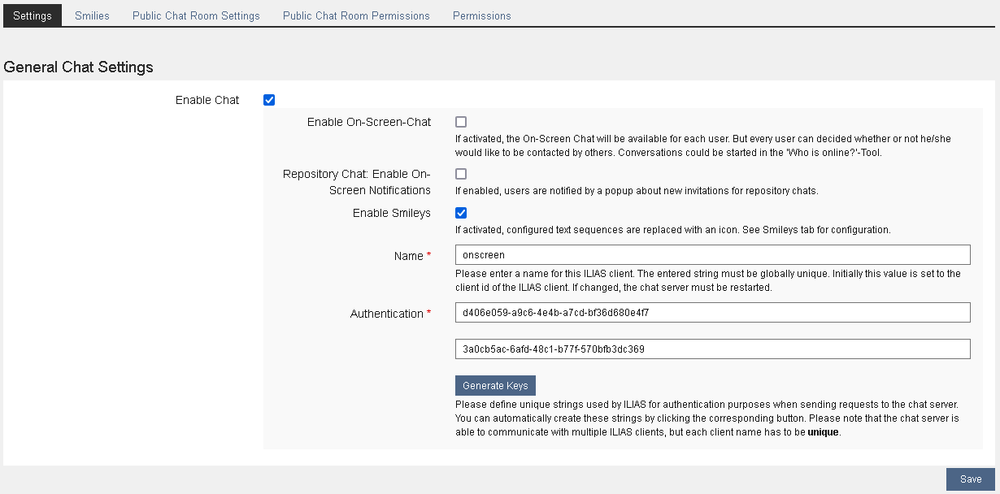
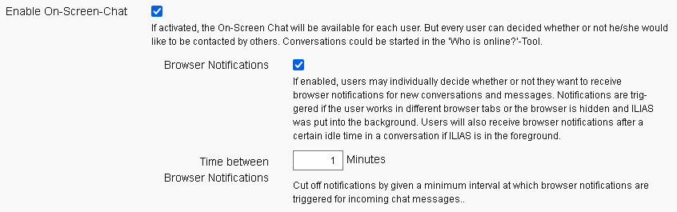
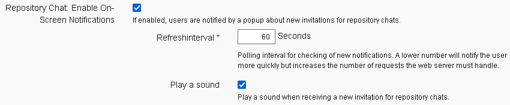

# Chat Server Setup

The keywords “MUST”, “MUST NOT”, “REQUIRED”, “SHALL”, “SHALL NOT”, “SHOULD”,
“SHOULD NOT”, “RECOMMENDED”, “MAY”, and “OPTIONAL” in this document are to be
interpreted as described in [RFC 2119](https://www.ietf.org/rfc/rfc2119.txt).

**Table of Contents**
<!-- TOC -->

  - [Requirement](#requirement)
  - [ILIAS configuration](#ilias-configuration)
    - [Chat Server Settings](#chat-server-settings)
      - [IP Address / FQDN](#ip-address--fqdn)
        - [Port](#port)
        - [Relative Path](#relative-path)
        - [Protocol](#protocol)
        - [Logging](#logging)
        - [Connection ILIAS to server](#connection-ilias-to-the-server)
        - [Connection client to server](#connection-client-to-the-server)
        - [Delete old messages](#delete-old-messages)
      - [General Chat Settings](#general-chat-settings)
        - [Enable chat](#enable-chat)
        - [Repository Chat: Enable on-screen notifications](#repository-chat-enable-on-screen-notifications)
        - [Name and Authentication](#name-and-authentication)
  - [Server Configuration](#server-configuration)
      - [Single ILIAS client:](#single-ilias-client)
      - [Multiple ILIAS client:](#multiple-ilias-clients)
  - [Start chat server automatically](#start-the-chat-server-automatically)
      - [systemd (ubuntu)](#systemd-ubuntu)
  - [Proxy Configuration](#proxy-configuration)
      - [Proxy configuration via nginx](#proxy-configuration-via-nginx)
      - [Proxy configuration via apache2](#proxy-configuration-via-apache2)
  - [Development](#development)
      - [Dependency Management](#dependency-management)

<!-- /TOC -->

# Requirement

A prerequisite for the chat server is Node.js. The chat server is tested with the
versions mentioned in our [installation](../../docs/configuration/install.md#recommended-setup-for-running-ilias) documentation.

The latest version can be downloaded at the following URL: https://github.com/nodesource/distributions#installation-instructions

In addition, [here](https://github.com/nodesource/distributions#debian-and-ubuntu-based-distributions "here") is an installation guide for the respective Unix-based operating system.

The basic configuration of the client settings are done within ILIAS in the section `Administration / Repository and Objects / Chat Room`. After the client settings have been saved in the database, the configuration file  and `client.cfg` is stored in the external ILIAS data directory in the subdirectory `chatroom`.
Additionally the server settings are obtained from database and stored as `server.cfg` in subdirectory `chatroom` mentioned above.
Both files MUST be passed to start the Chat Server (see [Server Configuration](#server-configuration)).



**Note:** On all changes to the settings, the chat server MUST be restarted!

## ILIAS Configuration

### Chat Server Settings

The settings to connect ILIAS to the chat server need to be provided via the
[configuration for the setup of ILIAS](../../docs/configuration/install.md#install-ilias).
Add a section "chatroom" on the toplevel of the JSON in the configuration file:

```
{
    ...
    "utilities" : {...},
    "chatroom": {
    }
}
```

In this section, add the various configuration options according to your requirements.

"address" and "port" of the server:

```
{
    ...
    "chatroom": {
        "address" : "chat.myilias.de",
        "port" : "8888"
    }
}
```

#### IP address / FQDN
The IPv4 address or FQDN where the chat server is to be bound.

Examples:

* `chat.myilias.de`
* `192.168.1.1`

#### Port

The port on which the chat server is to be bound.

Example:

* `8888`

#### Relative Path

This configuration section is only needed if the chat server is not running directly below the ILIAS document root directory and the chat server URL looks like this: `http (s): // [IP / DOMAIN] / [PATH] / [TO] / [CHAT] `. For some technical requirements it MAY be necessary to use the relative path.

Examples:


* `https://myilias.de/servers/chat` (relative path: "/servers/chat")
* `https: // myilias.de` (relative path: [leave field empty])

```
{
    ...
    "chatroom": {
        ...
        "sub_directory" : "/servers/chat"
    }
}
```

#### Protocol

* **HTTP**: To use an unencrypted communication over HTTP with the chat server just omit the following section `https`.

* **HTTPS**: There is SSL encrypted communication over HTTP with the chat server. The following settings are necessary.
  *   Certificate: absolute server path to the SSL certificate (eg: `/ etc / ssl / certs / server.pem`).
  *   Key: absolute server path to the private key (eg: * `/ etc / ssl / private / server.key`).
  *   Diffie-Hellman parameter: absolute server path to Diffie-Hellman file (eg: `/ etc / ssl / private / dhparam.pem`),
  *   Diffie-Hellman parameter creation (e.g., generated via: `openssl dhparam -out /etc/ssl/private/dhparam.pem 2048`).

```
{
    ...
    "chatroom": {
        ...
        "https:" : {
            "cert" : "/etc/ssl/certs/server.pem",
            "key" : "/etc/ssl/private/server.key",
            "dhparam" : "/etc/ssl/private/dhparam.pem"
        }
    }
}
```

#### Logging

The paths for the chat server log and the error log can be specified OPTIONALLY.

*  Chat server log file: Absolute server path to the log file (eg `/var/www/ilias/data/chat.log`), into which the chat server logs general events.
*  Chat server error log file: Absolute server path to the error log file (for example, `/var/www/ilias/data/chat_errors.log`), into which the chat server logs errors.
*  Chat server log level: The log level used for the chat log file
      * emerg
      * alert
      * crit
      * error
      * warning
      * notice
      * info
      * debug
      * silly

If no paths are defined, the chat server creates the log file in the chat server directory.

```
{
    ...
    "chatroom": {
        ...
        "log" : "/var/www/ilias/data/chat.log",
        "log_level" : "warning",
        "error_log" : "/var/www/ilias/data/chat_errors.log"
    }
}
```

#### Connection ILIAS to the server

By default, ILIAS uses the IP address or FQDN set in the server configuration. It is recommended that the chat server is only locally accessible and made publicly available through a proxy server. In this case, another URL MUST be specified, via which the PHP processor can connect to the chat server.

```
{
    ...
    "chatroom": {
        ...
        "ilias_proxy" : {
            "ilias_url" : "https://chat.myilias.de"
        }
    }
}
```

**Note:** It is possible to specify the URL with and without protocol definition. If no protocol is specified, the protocol definition setting for the URL will be used.

#### Connection client to the server

This is the connection the browser (client) uses to the chat server. The URL MUST be reachable by all browser clients.

```
{
    ...
    "chatroom": {
        ...
        "client_proxy" : {
            "client_url" : "https://chat.myilias.de"
        }
    }
}
```

#### Delete old messages

The deletion of old messages can be activated by selecting an ***Interval***. After this interval, all past messages are deleted, depending on the configured threshold. Both messages from the repository chat and from the on-screen chats are deleted.

Setting deletion_unit MUST be one of:
* days
* weeks
* months
* years
		
```
{
    ...
    "chatroom": {
        ...
        "deletion_interval" : {
            "deletion_unit" : "months",
            "deletion_value" : "3",
            "deletion_time" :  "03:00"
        }
    }
}
```

### General Chat Settings


#### Enable chat

The chat can be activated or deactivated via the selection field.
If activated, browser notifications MAY be activated to notify users about new chat messages.



#### Repository Chat: Enable on-screen notifications

If enabled, users will be informed by a pop-up about new invitations in repository chats.



**Note**: Less time allows more timely notifications, but increases server load.

#### Name and Authentication

To establish a connection between an ILIAS client and a chat server,
a unique name MUST be defined in the ILIAS client. It is imperative that each name is unique within a chat server instance.

In order to protect the chat server against unauthorized access, a key pair for the ***authentication*** MUST be generated for each client.

Example:

* Authentication Key = 0cdc8989-d5f0-1111-4444-244320d9dabc
* Authentication Secret = f7471a0e-c454-2222-3333-bb0f1b5d4123

## Server configuration

If the chat server is to be run in a different directory, the entire ILIAS chat directory (`ILIAS / Modules / Chatroom / chat`) MUST be copied to the desired directory.

**Note**: The following configuration files are generated in ILIAS (see - [ILIAS Configuration](#ilias-configuration)). These files MUST be copied again when changing the configuration in ILIAS!

The two configuration files `server.cfg` and `client.cfg` can be found in the path `[PATH_TO_EXTERNAL_DATA_DIRECTORY] / [ANY_CLIENT_ID] / chatroom`.

server.cfg:
```json
{
    "protocol": "http",
    "port": 8888,
    "address": "chat.myilias.de",
    "cert": "",
    "key": "",
    "dhparam": "",
    "log": "\/var\/www\/ilias\/data\/chat.log",
    "log_level": "info",
    "error_log": "\/var\/www\/ilias\/data\/chat_errors.log",
    "sub_directory": "",
    "deletion_mode": 1,
    "deletion_unit": "months",
    "deletion_value": 3,
    "deletion_time": "03:00"
}
```

client.cfg:
```json
{
    "name": "onscreen",
    "enable_osd": false,
    "enable_osc": true,
    "enable_browser_notifications": true,
    "conversation_idle_state_in_minutes": 1,
    "osd_intervall": 60,
    "chat_enabled": true,
    "enable_smilies": true,
    "play_invitation_sound": false,
    "auth": {
        "key": "0cdc8989-d5f0-1111-4444-244320d9dabc",
        "secret": "f7471a0e-c454-2222-3333-bb0f1b5d4123"
    },
    "database": {
        "type": "mysql",
        "host": "localhost",
        "port": 3306,
        "name": "ilias_db",
        "user": "dbuser",
        "pass": "geheim"
    }
}
```

### Single ILIAS client:

The following is the command to start a chat server for a single client.

```bash
cd [ILIAS_ROOT_DIRECTORY]
node Modules/Chatroom/chat/chat.js \
  [PATH_TO_EXTERNAL_DATA_DIRECTORY]/[CLIENT_ID]/chatroom/server.cfg \
  [PATH_TO_EXTERNAL_DATA_DIRECTORY]/[CLIENT_ID]/chatroom/client.cfg &
```

### Multiple ILIAS clients:

The following shows the command that can be used to start a multi-client chat server.

```bash
cd [ILIAS_ROOT_DIRECTORY]
node Modules/Chatroom/chat/chat.js \
  [PATH_TO_EXTERNAL_DATA_DIRECTORY]/[ANY_CLIENT_ID]/chatroom/server.cfg \
  [PATH_TO_EXTERNAL_DATA_DIRECTORY]/[CLIENT_ID_1]/chatroom/client.cfg \
  [PATH_TO_EXTERNAL_DATA_DIRECTORY]/[CLIENT_ID_2]/chatroom/client.cfg ... &
```
Whether the chat server is running can be checked with the command ***netstat***. In the output, the service SHOULD be displayed with the specified ip:port.

```bash
netstat -tlpn | grep node
```

In addition, the function can be checked via the following URL. If successful, the status code **200** will be returned.

```bash
curl http(s)://myilas.de/backend/Heartbeat/onscreen

{
  "status": 200
}
```

## Start the chat server automatically

On Unix-based operating systems, there are various systems for managing services, e.g. SysVinit, systemd, etc.

### systemd (ubuntu)

To automatically start the chat server with systemd, a file is stored in `/ etc / systemd / system / chat.myilias.service` created with the following content.

**Note:** The paths MUST be adjusted accordingly. For multiple clients, unique names MUST be assigned to the client.cfg, e.g. a_client.cfg, b_client.cfg, etc.

```ini
[Unit]
Description=ILIAS onscreenchat
After=syslog.target network.target

[Service]
EnvironmentFile=-/etc/environment
Type=simple
User=onscreenchat
Group=onscreenchat
WorkingDirectory=/%path%/%to%/%onscreenchat%
ExecStart=/bin/sh -c "/usr/bin/node /%path%/%to%/%onscreenchat%/chat.js \
  /%path%/%to%/%onscreenchat%/server.cfg \
  /%path%/%to%/%onscreenchat%/%allclient%/*_client.cfg"
Restart=always
RestartSec=3

[Install]
WantedBy=multi-user.target
```

It is recommended to use a specific user and group for running the Node.js chat server instance:

```
useradd --system -d /%path%/%to%/%onscreenchat% -c "ILIAS onscreenchat" onscreenchat;
chown onscreenchat:onscreenchat -R /%path%/%to%/%onscreenchat%/;
usermod -a -G onscreenchat onscreenchat;
```
Additionally this user must be granted read access to configured `server.cfg` and `client.cfg`s.


## Proxy configuration

It is recommended to make the chat server publicly available only through a proxy server.
This section describes how to use such a proxy server with `nginx` or` Apache2`.

### Proxy configuration via nginx

Global configuration:

    proxy_set_header   Upgrade          $http_upgrade;
    proxy_set_header   Connection       $connection_upgrade;

    # we're in the http context here
    map $http_upgrade $connection_upgrade {
        default upgrade;
        ''      close;
    }


vHost Configuration:

    upstream onscreenchat  {
        server      127.0.0.1:8888;
        keepalive   16;
    }

    location ~ ^/(chat|socket.io|backend) {
        proxy_pass         http://onscreenchat;
        proxy_http_version 1.1;
        proxy_buffering off;
        access_log  /var/log/nginx/onscreenchat.access.log ;
    }


In the ILIAS configuration the proxy configurations are adjusted in the ***Chatserver settings***.

Example:

    https://onscreenchat.domain.de


### Proxy configuration via apache2

The configuration takes place in the Apache default configuration or in the corresponding vHost. In addition, the following Apache modules are REQUIRED:
proxy, proxy_connect, proxy_html, proxy_http, proxy_wstunnel, xml2enc

    ProxyPassMatch backend/(.*)$ http://127.0.0.1:8888/$0
    ProxyPassMatch ^chat/(.*)$   http://127.0.0.1:8888/$0

    RewriteEngine On
    RewriteCond %{REQUEST_URI} ^/socket.io/              [NC]
    RewriteCond %{HTTP:Upgrade} websocket                [NC]
    RewriteRule /(.*)           ws://127.0.0.1:8888/$1   [P]

    RewriteCond %{QUERY_STRING} transport=polling        [NC]
    RewriteRule /(.*)           http://127.0.0.1:8888/$1 [P]

In the ILIAS configuration the proxy configurations are adjusted in the ***Chat server settings***.

Example:

    https://onscreenchat.domain.de


### Development

#### Dependency Management

The node module dependencies should be managed by 
using [Yarn](https://yarnpkg.com/en/) instead of [npm](https://www.npmjs.com/).

Dependencies can be updated by the following command:
```bash
cd ./Modules/Chatroom/chat
yarn install
```
