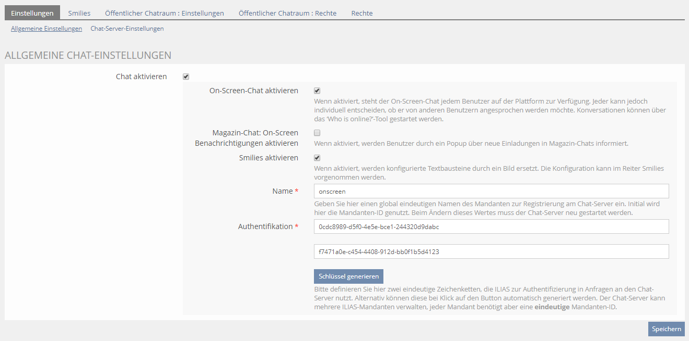
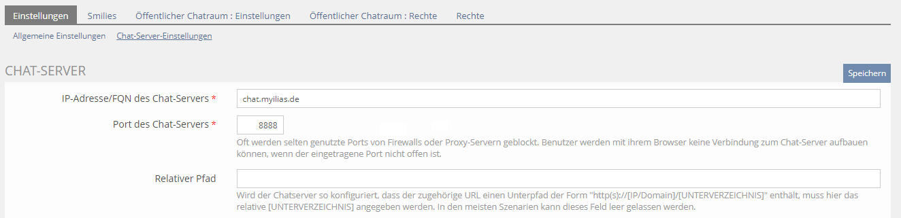
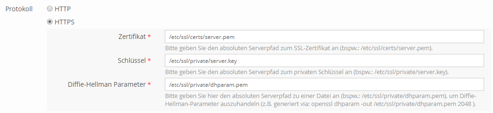
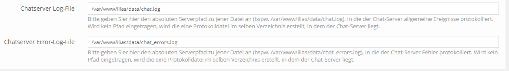
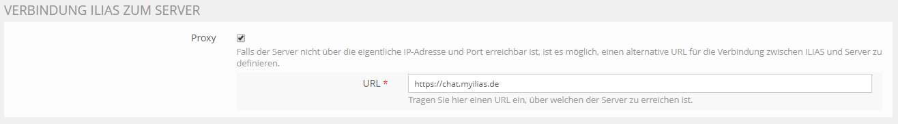
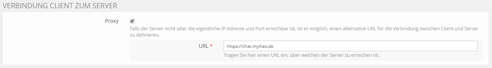
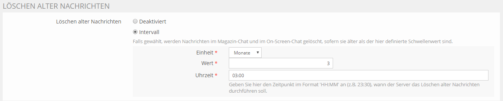
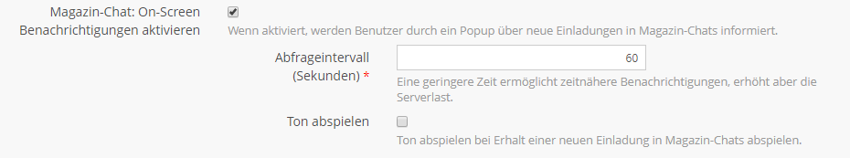

# Chat Server Setup

**Inhaltsverzeichnis**
<!-- TOC -->

  - [Voraussetzung](#voraussetzung)
  - [ILIAS Konfiguration](#ilias-konfiguration)
      - [Chat-Server-Einstellungen](#chat-server-einstellungen)
          - [IP-Adresse/FQDN](#ip-adressefqdn)
          - [Port](#port)
          - [Relativer Pfad](#relativer-pfad)
          - [Protokoll](#protokoll)
          - [Logging](#logging)
          - [Verbindung ILIAS zum Server](#verbindung-ilias-zum-server)
          - [Verbindung Client zum Server](#verbindung-client-zum-server)
          - [Löschen alter Nachrichten](#l%C3%B6schen-alter-nachrichten)
      - [Allgemeine-Einstellungen](#allgemeine-einstellungen)
          - [Chat aktivieren](#chat-aktivieren)
          - [Magazin-Chat: On-Screen Benachrichtigungen aktivieren](#magazin-chat-on-screen-benachrichtigungen-aktivieren)
          - [Name und Authentifikation](#name-und-authentifikation)
  - [Server Konfiguration](#server-konfiguration)
      - [Single ILIAS Mandant:](#single-ilias-mandant)
      - [Multiple ILIAS Mandant:](#multiple-ilias-mandant)
  - [Chat Server automatisch starten](#chat-server-automatisch-starten)
      - [systemd (ubuntu)](#systemd-ubuntu)
  - [Proxy Konfiguration](#proxy-konfiguration)
      - [Proxy Konfiguration per nginx](#proxy-konfiguration-per-nginx)
      - [Proxy Konfiguration per apache2](#proxy-konfiguration-per-apache2)

<!-- /TOC -->

# Voraussetzung

Eine Voraussetzung für den Chat Server ist Node.js. Der Chat Server ist mit folgenden Versionen von Node.js getestet:

* 8.9.4 (LTS)
* 9.7.1


Die letzte Version kann unter der folgenden URL herunterladen werden: https://github.com/nodesource/distributions#debinstall

Zudem befindet sich [hier](https://github.com/nodesource/distributions#deb "hier") eine Installationanleitung für das jeweilige unix-basierte Betriebssystem.


Die Grundkonfiguration erfolgt innerhalb von ILIAS in dem Bereich `Administration/Chat`. Nachdem die Server- und Clienteinstellungen gespeichert wurden, sind im externen ILIAS Data Verzeichnis im Unterverzeichnis `chatroom` die Konfigurationsdateien `server.cfg` und `client.cfg` abgelegt. Diese Dateien müssen für den Start des Chat Servers übergeben werden (siehe [Server Konfiguration](#Server-Konfiguration)).



***Hinweis:*** Bei allen Änderungen der Einstellungen, **muss** der Chat Server zwingend neu gestartet werden!

## ILIAS Konfiguration

### Chat-Server-Einstellungen




#### IP-Adresse/FQDN
Die IPv4 Adresse oder der FQDN, auf dem der Chat Server gebunden werden soll.

Beispiel:

*  `chat.myilias.de`
*  `192.168.1.1`

#### Port

Der Port auf dem der Chat Server gebunden werden soll.

Beispiel:

* `8888`

#### Relativer Pfad

Dieser Konfigurationsabschnitt wird nur benötigt, wenn der Chat Server nicht direkt unterhalb des ILIAS Document-Root Verzeichnis ausgeführt und die Chat Server URL wie folgt aussieht: `http(s)://[IP/DOMAIN]/[PATH]/[TO]/[CHAT]`. Für einige technische Anforderungen kann es notwendig sein den relativen Pfad zu verwenden.

Beispiele:


*  `https://myilias.de/servers/chat` (Relativer Pfad: "/servers/chat")
*  `https://myilias.de` (Relativer Pfad: [Feld leer lassen])

#### Protokoll




* **HTTP**: Es findet eine unverschlüsselte Kommunikation über HTTP mit dem Chat-Server statt.

* **HTTPS**: Es findet eine mit SSL verschlüsselte Kommunikation über HTTP mit dem Chat-Server statt. Folgende Einstellungen sind notwendig.
  * Zertifikat: absoluter Serverpfad zum SSL-Zertifikat (bspw.: `/etc/ssl/certs/server.pem`).
  * Schlüssel: absoluter Serverpfad zum privaten Schlüssel (bspw.: * `/etc/ssl/private/server.key`).
  * Diffie-Hellman Parameter: absoluter Serverpfad zu Diffie-Hellman Datei (bspw.: `/etc/ssl/private/dhparam.pem`),
  * Diffie-Hellman-Parameter Erstellung (z.B. generiert via: `openssl dhparam -out /etc/ssl/private/dhparam.pem 2048` ).

#### Logging




Optional können die Pfade für den Chat Server Log und das Fehler Log angegeben werden.

  *   Chat Server Log-File: Absoluter Serverpfad zum Log-File (bspw. `/var/www/ilias/data/chat.log`), in die der Chat Server allgemeine Ereignisse protokolliert.

  *   Chat Server Error-Log-File: Absoluter Serverpfad zur Error-log-File an (bspw. `/var/www/ilias/data/chat_errors.log`), in die der Chat Server Fehler protokolliert.

Werden keine Pfade definiert, erstellt der Chat Server das Log-File im Chat Server Verzeichnis.

#### Verbindung ILIAS zum Server

Standardmäßig nutzt ILIAS die IP-Adresse oder den FQDN der bei der Serverkonfiguration eingestellt ist. Es ist empfiehlt sich, dass der Chat-Server nur lokal erreichbar ist und über einen Proxy-Server öffentlich zur Verfügung gestellt wird. In diesem Fall muss eine andere URL angegeben werden, über welche der Client eine Verbindung zum Chat-Server aufbauen kann.



**Hinweis:** Es ist möglich die URL mit und ohne Protokolldefinition anzugeben. Wenn kein Protokoll angegeben wird, wird die Einstellung der Protokolldefinition für die URL verwendet.

#### Verbindung Client zum Server

Siehe [Verbindung ILIAS zum Server](#verbindung-ilias-zum-server) hierbei handelt es sich um die Verbindung die der Browser (Client) zum Chat Server verwendet. Die URL muss von allen Browser Clients erreicht werden können.



#### Löschen alter Nachrichten

Das Löschen alter Nachrichten kann durch die Auswahl eines ***Intervalls*** aktiviert werden. Nach Ablauf dieses Intervalls werden Abhängig vom konfigurierten Schwellwert, alle vergangenen Nachrichten gelöscht. Dabei werden sowohl Nachrichten aus dem Magazin-Chat, als auch aus den On-Screen-Chats gelöscht.




### Allgemeine-Einstellungen


#### Chat aktivieren

Über das Auswahlfeld kann der Chat aktiviert bzw. deaktiviert werden.

#### Magazin-Chat: On-Screen Benachrichtigungen aktivieren

Wenn aktiviert, werden Benutzer durch ein Pop-up über neue Einladungen in Magazin-Chats informiert.



***Hinweis***: Eine geringere Zeit ermöglicht zeitnähere Benachrichtigungen, erhöht aber die Serverlast.

#### Name und Authentifizierung

Um eine Verbindung zwischen einem ILIAS Mandanten und einem Chat-Server herstellen zu können,
muss im ILIAS Mandant ein eindeutiger Name definiert werden. Es ist zwingend erforderlich, dass jeder Name innerhalb einer Chat-Server Instanz eindeutig ist.

Um den Chat-Server vor unbefugtem Zugriff abzusichern, muss für jeden Mandanten ein Schlüsselpaar zur ***Authentifizierung*** generiert werden.

Beispiel:

  * Authentifizierungs-Schlüssel = 801c4a44-739a-45d8-93df-880e7a2ac8e7
  * Authentifizierungs-Geheimnis = 04e60a6e-e9e7-4eb7-bd01-96e65b9a767c

## Server Konfiguration

Wenn der Chat Server in einem anderen Verzeichnis ausgeführt werden soll, muss das gesamte ILIAS Chat Verzeichnis (`ILIAS/Modules/Chatroom/chat`) in das gewünschte Verzeichnis kopiert werden.

***Hinweis***: Die folgenden Konfigurationsdateien werden in ILIAS erzeugt (siehe - [ILIAS Konfiguration](#ilias-konfiguration)). Diese **müssen** bei einer Änderung der Konfiguration in ILIAS wieder erneut kopiert werden!

Die beiden Konfigurationsdateien `server.cfg` und `client.cfg` sind im Pfad `[PATH_TO_EXTERNAL_DATA_VERZEICHNIS]/[ANY_CLIENT_ID]/chatroom` zu finden.

server.cfg:
```json
{
    "protocol": "http",
    "port": "8888",
    "address": "chat.myilias.de",
    "cert": "",
    "key": "",
    "dhparam": "",
    "log": "\/var\/www\/ilias\/data\/chat.log",
    "error_log": "\/var\/www\/ilias\/data\/chat_errors.log",
    "sub_directory": "",
    "deletion_mode": "1",
    "deletion_unit": "month",
    "deletion_value": "3",
    "deletion_time": "03:00"
}
```


client.cfg:
```json
{
    "name": "onscreen",
    "enable_osd": false,
    "enable_osc": true,
    "osd_intervall": 60,
    "chat_enabled": true,
    "enable_smilies": true,
    "play_invitation_sound": false,
    "auth": {
    "key": "0cdc8989-d5f0-1111-4444-244320d9dabc",
    "secret": "f7471a0e-c454-2222-3333-bb0f1b5d4123"
    },
    "database": {
        "type": "mysql",
        "host": "localhost",
        "port": 3306,
        "name": "ilias_db",
        "user": "dbuser",
        "pass": "geheim"
    }
}
```

### Single ILIAS Mandant:

Im Folgenden wird der Befehl dargestellt, mit welchem ein Chat-Server für einen einzigen Mandanten gestartet werden kann.

```bash
cd [ILIAS_ROOT_VERZEICHNIS]
node Modules/Chatroom/chat/chat [PATH_TO_EXTERNAL_DATA_VERZEICHNIS]/[CLIENT_ID]/chatroom/server.cfg [PATH_TO_EXTERNAL_DATA_VERZEICHNIS]/[CLIENT_ID]/chatroom/client.cfg &
```


### Multiple ILIAS Mandanten:

Im Folgenden wird der Befehl dargestellt, mit welchem ein Chat-Server für mehrere Mandanten gestartet werden kann.

```bash
cd [ILIAS_ROOT_VERZEICHNIS]
node Modules/Chatroom/chat/chat [PATH_TO_EXTERNAL_DATA_VERZEICHNIS]/[ANY_CLIENT_ID]/chatroom/server.cfg [PATH_TO_EXTERNAL_DATA_VERZEICHNIS]/[CLIENT_ID_1]/chatroom/client.cfg [PATH_TO_EXTERNAL_DATA_VERZEICHNIS]/[CLIENT_ID_2]/chatroom/client.cfg ... &
```

Ob der Chat Server läuft, kann mit dem Befehl ***netstat*** überprüft werden. In der Ausgabe sollte der Dienst mit dem angegeben ip:port angezeigt werden.

```bash
netstat -tlpn
```

Zudem kann die Funktion über die folgende URL überprüft werden. Bei Erfolg wird der Statuscode **200** zurückgegeben.

```bash
curl http(s)://myilas.de/backend/Heartbeat/onscreen

{
  "status": 200
}
```

## Chat Server automatisch starten

Auf Unix-basierenden Betriebssystem gibt es verschiedene Systeme um Dienste zu verwalten, z.B. SysVinit, systemd, etc.

### systemd (ubuntu)

Um den Chat Server mit systemd automatisch zu starten wird in `/etc/systemd/system` eine Datei z.B. chat.myilias.service mit folgendem Inhalt angelegt.

***Hinweis:*** Die Pfade müssen entsprechend angepasst werden. Bei mehreren Mandanten müssen eindeutige Namen für die client.cfg vergeben werden, z.B. a_client.cfg, b_client.cfg, etc.

```ini
[Unit]
Description=ILIAS onscreenchat
After=syslog.target network.target

[Service]
EnvironmentFile=-/etc/environment
Type=simple
User=onscreenchat
Group=onscreenchat
WorkingDirectory=/%path%/%to%/%onscreenchat%
ExecStart=/bin/sh -c "/usr/bin/node /%path%/%to%/%onscreenchat%/chat.js /%path%/%to%/%onscreenchat%/server.cfg /%path%/%to%/%onscreenchat%/%allclient%/*_client.cfg"
Restart=always
RestartSec=3

[Install]
WantedBy=multi-user.target
```

## Proxy Konfiguration

Es ist empfohlen den Chat-Server ausschließlich über einen Proxy-Server öffentlich zur Verfügung zu stellen.
In diesem Abschnitt wird beschrieben, wie ein solcher Proxy-Server mit `nginx` oder `Apache2` durchgeführt werden kann.

### Proxy Konfiguration per nginx

globale Konfiguration:

    proxy_set_header   Upgrade          $http_upgrade;
    proxy_set_header   Connection       $connection_upgrade;

    # we're in the http context here
    map $http_upgrade $connection_upgrade {
        default upgrade;
        ''      close;
    }


vHost Konfiguration:

    upstream onscreenchat  {
        server      127.0.0.1:8888;
        keepalive   16;
    }

    location ~ ^/(chat|socket.io|backend) {
            proxy_pass         http://onscreenchat;
            proxy_http_version 1.1;
            proxy_buffering off;
            access_log  /var/log/nginx/onscreenchat.access.log ;
    }


In der ILIAS Konfiguration wird bei den ***Chat-Server-Einstellungen*** die Proxy Konfigurationen angepasst.

Beispiel:

    https://onscreenchat.domain.de


### Proxy Konfiguration per apache2

Die Konfiguration erfolgt in der Apache default-Konfiguration oder im entsprechendem vHost. Zudem werden folgende Apache-Module benötigt:
proxy, proxy_connect, proxy_html, proxy_http, proxy_wstunnel, xml2enc

    ProxyPassMatch backend/(.*)$ http://127.0.0.1:8888/$0
    ProxyPassMatch ^chat/(.*)$   http://127.0.0.1:8888/$0

    RewriteEngine On
         RewriteCond %{REQUEST_URI} ^/socket.io/           [NC]
        RewriteCond %{HTTP:Upgrade} websocket               [NC]
        RewriteRule /(.*)           ws://127.0.0.1:8888/$1  [P]

        RewriteCond %{QUERY_STRING} transport=polling       [NC]
        RewriteRule /(.*)           http://127.0.0.1:8888/$1 [P]

In der ILIAS Konfiguration wird bei den ***Chat-Server-Einstellungen*** die Proxy Konfigurationen angepasst.

Beispiel:

    https://onscreenchat.domain.de
