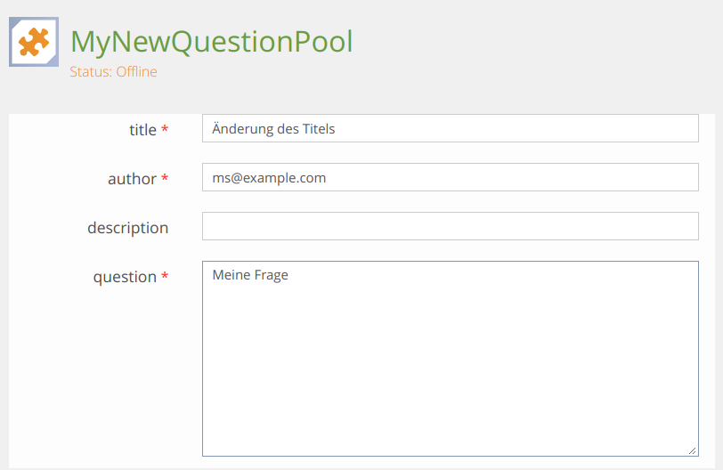

# CQRS with Event Sourcing

## Why we introduce a new software paradigm for the Assessment Question Service
We had a look to the actual behavior and chalenges and the future requirements for the ILIAS Test Assessment and searched a software paradigm which helps us to solve the problems and covers the future requirements. The software paradigm we searched should also help us to make it possible to have more than one developer who can fix Bugs in the Assessment Question Service and that we can cover most of the service with unit tests.

With our concept we like to give a implementation solution for the followint requirements:

1  _Unique IDs for Test Questions_ (https://docu.ilias.de/goto_docu_wiki_wpage_4571_1357.html_docu_wiki_wiki_page_4571_1357.html)
2 And _Item Statistic in Pool_ (https://docu.ilias.de/goto_docu_wiki_wpage_5321_1357.html)

3 In the future we could think about to have the possibility to change questions in a test no matter if it already contains user data records or not - and we would like to offer this function audit-proof!

4 There are several authors who can work on a question. There is no history and no easy way to reset a question to a previous state. A question history is a current feature request for the ILIAS test [https://docu.ilias.de/goto_docu_wiki_wpage_5312_1357.html]

5 Collaborative Work

6 Offline Tests


## Good to know
The CQRS with Event Sourcing paradigm offers a very good solution for the above requirements. It is not a paradigm that covers every use case outside the Assessment Question Service within ILIAS. But using this paradigm in similar contexts could, however, be very helpful.
 

## Terminology
### CQRS
CQRS is the the acronym of Command Query Responsibility Segregation. It is a pattern defined by Greg Young:
* Summary by Greg Young: http://codebetter.com/gregyoung/2010/02/16/cqrs-task-based-uis-event-sourcing-agh/
* CQRS Documents by Greg Young: https://cqrs.files.wordpress.com/2010/11/cqrs_documents.pdf

CQRS suggests to separate the read-/query- from the write-/the command side. This is especially valuable as we can provide on the side where the student gets a question for answering, only questions of a willingly provided revision.

### CQRS and Event Sourcing
We use the Event Sourcing as the data storage mechanism for the domain. So we use the event model as persistence model on the command side. At the read side we use a classical data structure well known from other ILIAS modules.

### Command Side - Domain Driven Design Approach
We use the Domain Driven Design Approach for the command side. With this approach we are able to to express a domain model and a business logic/domain behaviour in the clearest possible object oriented form. With Domain Driven Design we have a standardized approach how to design a domain model, so our developers can understand the implementation more easily, and can effectively communicate with each other using the Domain Driven Design terms.
 
The domain entities are implemented within a specific layer, which knows nothing about the database persistence and the user interface. The data are stored within the entities as data properties, and the persistence layer makes sure that these data are correctly persisted into the data base.

The domain entities have a rich behaviour like calculations and validations implemented. Important to know is therefore, that the entities / value objects are are not only bags of data properties without any behaviour.

### Read Side
The Read Side is optimized for reading. There we return DTOs or simple arrays.

# Internal Implementation of the Command Side
Note: _For the public external API see Pullrequest: https://github.com/ILIAS-eLearning/ILIAS/pull/2016_

## Create a Question

**1. Start the Bus with a new CreateQuestionCommand**
By getting the save command from the client. We start a chain of command for this concrete need: _Create a question_ 

For this 
* We initalize the internal application service with the standard properties. We call them _...spec._
* We execute the CreateQuestion method with the additional demanded properties.

The service initiate a the specific command object _CreateQuestionCommand_ and starts the command bus.

Note: _A command is just a class with some mandatory properties. Commands are handled by exactly one CommandHandler. For each Task to fulfill we have a separate Command Object. Like the example here for creating a auestion. This ensures that we have all the necessary data from the start of the process._


```
class ilAsqQuestionAuthoringGUI {
[...]

$authoring_service_spec = new AuthoringApplicationServiceSpec(
    $question_uuid,
    $initiating_usr_id
);

$authoring_service = new AuthoringApplicationService($authoring_service_spec);


$authoring_service->CreateQuestion(
    new QuestionContainer($container_obj_id),
    new AnswerType('multiplechoice_id')
);
```
The CreateQuestion Method at the Application Service looks like follow
```
class AuthoringApplicationService {

[...]

public function CreateQuestion(
        QuestionContainer $question_container,
		AnswerType $answer_type): void {
		CommandBusBuilder::getCommandBus()->handle(
			new CreateQuestionCommand(
				$this->service_spec->getQuestionUuid(),
				$this->service_spec->getInitiatingUserId(),
				$question_container,
				$answer_type)
		);
	}

```

**2. Delegate the command to the Command Handler**
Currently our command bus has only one task. Distributing a command to the corresponding command handler. Later we could think about providing the command bus with additional middlerwares, which will do further actions before or after handling the command or implement an other behavior if necessary. For example, execute a command asynchronously.

We decided that we connect the commands using naming conventions:
* CreateQuestionCommand -> CreateQuestionCommandHandler
```
//
class QuestionCommandBus {
[...]

        /**
    	 * @param Command $command
    	 *
    	 * @throws DomainException
    	 */
    	public function handle(Command $command): void {
    
    		foreach ($this->middlewares as $middleware) {
    			$command = $middleware->handle($command);
    		}
    
    		$handler_name = get_class($command).'Handler';
    		/** @var CommandHandlerContract $handler */
    		$handler = new $handler_name;
    
    		if (!is_object($handler)) {
    			throw new DomainException(sprintf("No handler found for command %s", $command));
    		}
    
    		$handler->handle($command);
    	}

[...]

```

**3. Command Handling**
The CommandHandler handles the Command. In this case
 3.1 A new Question Aggregate is created. 
 3.2 The setQuestionContainer-Method of the question is executed.
 3.3 The Save-Method of the repository is executed.
```
class CreateQuestionCommandHandler {

[...]

	public function handle(Command $command) {
		    $question = Question::createNewQuestion(
        			$command->getQuestionUuid(),
        			$command->getInitiatingUserId(),
        			$command->getAnswerType()
        		);
        
            $question->setQuestionContainer(
                $command->getQuestionUuid(),
                $command->getInitiatingUserId(),
                $command->getQuestionContainer()
            );
        
        	QuestionRepository::getInstance()->save($question);
	}

[...]
}
```
**3.1 Create the Question Aggregate Root Object**
After creating the _Question Aggregate Root Object_ - before the setQuestionContainer-Method of the Question is executed (3.2) - the QuestionCreatedEvent (3.1.1) and the QuestionAnswerTypeSetEvent (3.1.2) are executed. As you can see for creating the question we decided to have a _question uuid_, an _initiating user id_, a _question answer type id_ (like multiple_choice) and a _question continer obj id_. Long-term we will probably not use for each question a _question container obj id_. But the _answer type_ we decided to have at the very beginning of the process.

```
class Question
[..]
    public static function createNewQuestion(
    		DomainObjectId $question_uuid,
    		int $initiating_user_id,
    		AnswerType $answer_type): Question {

    		$question = new Question();
    		$question->ExecuteEvent(
    			new QuestionCreatedEvent(
    				$question_uuid,
    				$initiating_user_id
    		));
    
    		$question->ExecuteEvent(
    			new QuestionAnswerTypeSetEvent(
    				$question_uuid,
    				$initiating_user_id,
    				$answer_type
    		));
    
    		return $question;
    	}
```
**3.1.1 Execute the Question Created Event**
The event will be applied 3.1.1.1 and recorded 3.1.1.2
 ```
 class Question
 [..]
    protected function ExecuteEvent(DomainEvent $event) {
 		// apply results of event to class, most events should result in some changes
 		$this->applyEvent($event);
 
 		// always record that the event has happened
 		$this->recordEvent($event);
 	}
 ```
**3.1.1.1 Determine the Apply-Method for the Question-Created-Event**
For applying an event, we have to determine the concrete Apply-Method. This could be done by an EventBus - or like we do this here under the responsibility of the Question Aggregate.

Note: The applyEvent-Method is in our case a genereric methods for determine the concrete method to apply the concrete event. We use it for any aggregate event. In our case we work like by the commands with a naming convention. The method name within the Question-Class - in this case is _applyQuestionCreatedEvent_.
```
class Question {
[...]
    const APPLY_PREFIX = 'apply';

    protected function applyEvent(DomainEvent $event) {
		$action_handler = $this->getHandlerName($event);

		if (method_exists($this, $action_handler)) {
			$this->$action_handler($event);
		}
	}

[...]

    private function getHandlerName(DomainEvent $event) {
		return self::APPLY_PREFIX . join('', array_slice(explode('\\', get_class($event)), - 1));
	}

```
**3.1.1.1.1 Handle applyQuestionCreatedEvent**

By appling the event _QuestionCreated_ the question object will be filled with data. In our case with the UUID and the CreatorUserId.

Note: Until now nothing is saved at the database! This because the command CreateQuestion has not finished the whole work!

```
protected function applyQuestionCreatedEvent(QuestionCreatedEvent $event) {
		$this->id = $event->getAggregateId();
		$this->creator_id = $event->getInitiatingUserId();
	}
```
**3.1.1.2 Record Event**
We record now, that the event has happend. We need this for later - for saving / persist the data in the database.
```
class Question {
[...]
    protected function recordEvent(DomainEvent $event) {
            $this->recordedEvents->addEvent($event);
        }
```
**3.1.2 Execute the Event QuestionAnswerTypeSetEvent**
The procedure is the same as above:
* applyEvent (Search for the concret apply method)
    * execute applyQuestionAnswerTypeSetEvent and allocate the question data with the _Answer Type Value Object_.
* Record the event.

**3.2 The QuestionContainerSetEvent is executed**
Same procedure as every ~~year~~ time
* Apply the event 
    * Execute the concrete applyEvent-Method
* Record the event.

**3.3 Save the Question / Notify about events**
At this point the question will be saved. If there were any errors before nothing get saved. We can always be sure that we have clean data in the data base. 

During the saving process, all events not yet processed are read and stored. After that it would be also the time to notify about the events to specific listener.

We that it should not be possible to listen to all events. And probably we will make separate summarized events for outside the boundary of this aggregate.
```
class QuestionRepository

    [...] 
    public function save(AbstractEventSourcedAggregateRoot $aggregate) {
		$events = $aggregate->getRecordedEvents();
		$this->getEventStore()->commit($events);
		$aggregate->clearRecordedEvents();
		
		$this->notifyAboutNewEvents();
	}
```

## Database based Eventstore
At this moment we saved the question at the command side in the aggregate specific event store. 


## Reconstitute Aggregate
Example Form

Eventstore


As you can see 
1. The generic question data (titel, description, author, question text) are in this example combined as a _Value Object_.
2. There were changes at the object. The changes did not result in an classical update. The changes were appended to the event store.

At the command side we read from the event store. We do that as follow:

```
class QuestionRepository

[...]

public function getAggregateRootById(DomainObjectId $aggregate_id) : AggregateRoot {
        $this->id = $aggregate_id;
		return $this->reconstituteAggregate(
            $this->getEventStore()->getAggregateHistoryFor($aggregate_id)
        );
		}
}

[...]
protected function reconstituteAggregate(
    DomainEvents $event_history
): AggregateRoot {
    return Question::reconstitute($event_history);
}
```

```
namespace ILIAS\AssessmentQuestion\Authoring\Infrastructure\Persistence\ilDB;

class ilDBQuestionEventStore

[...]

	public function getAggregateHistoryFor(DomainObjectId $id): DomainEvents {
    		global $DIC;
    
    		$sql = "SELECT * FROM " . ilDBQuestionStoredEvent::STORAGE_NAME . " where aggregate_id = " . $DIC->database()->quote($id->getId(),'string');
    		$res = $DIC->database()->query($sql);
    
    		$event_stream = new DomainEvents();
    		while ($row = $DIC->database()->fetchAssoc($res)) {
    			/**@var AbstractDomainEvent $event */
    			//TODO should not be saved in DB like this
    			$event_name = "ILIAS\\AssessmentQuestion\\Authoring\\DomainModel\\Question\\Event\\".utf8_encode(trim($row['event_name']));
    			$event = new $event_name(new DomainObjectId($row['aggregate_id']), $row['initiating_user_id']);
    			$event->restoreEventBody($row['event_body']);
    			$event_stream->addEvent($event);
    		}
    
    		return $event_stream;
    	}
```
At the end it's extremely simple. All events are applied.
```
Class Question {

[...]

    public static function reconstitute(DomainEvents $event_history): AggregateRoot {
		$question = new Question();
		foreach ($event_history->getEvents() as $event) {
			$question->applyEvent($event);
		}
		return $question;
	}
}
```

## Project to the read/query side - E.g. new Revisions
With projection the data could be saved in one or more ILIAS data tables. We use the combination of a repository and active records. Hereby data may be saved redundant. This should never be a problem because we are saving already validated data. And(!) in case of en error we can do this process again.

```
class ProjectQuestionsToListDb implements Projection {

	/**
	 * @param \ILIAS\AssessmentQuestion\Common\DomainModel\Aggregate\AggregateRoot $projectee
	 *
	 * @return mixed
	 */
	public function project(AggregateRoot $projectee) {
		$projectee_key = $projectee->getRevisionId()->GetKey();
		$item = QuestionListItem::where(array('question_id' => $projectee_key))->first();

		if($item == null) {
			$item = new QuestionListItem();
			$item->setQuestionId($projectee_key);
		}

		/** @var QuestionData $data */
		$data = $projectee->getData();
		$item->setTitle($data->GetTitle());
		$item->setDescription($data->getDescription());
		$item->setQuestion($data->getQuestionText());
		$item->store();
	}
}
```

# Outcome
You can see that the data flow in this concept is extremely clear. The Aggregate Root and the associated Value Objects ensure that the objects that are stored are valid at all times.

Developers who understand this concept can work together on a large project without getting in each other's way.

One can implement ValueObject, another can implement the commands, a third can develop the project level.

With this concept you have audit security per concept. Every change is traceable.

If you make statistics towards the project level and have a bug there, the project level can be deleted and completely rebuilt from the event store.

If an applying institution has an error, the event store helps with troubleshooting.

The concept is not a concept to be applied to simple objects. But imagine that the ILIAS course and its object relationships are subject to a revision. You could hold the same course in several revisions. One would not have to copy and archive courses after one year but could work continuously on the course.

ValueObjects are important in this concept. Whenever complicated business logic takes place, it is worthwhile to store the corresponding properties in a common Value Object, which ensures their validity.


