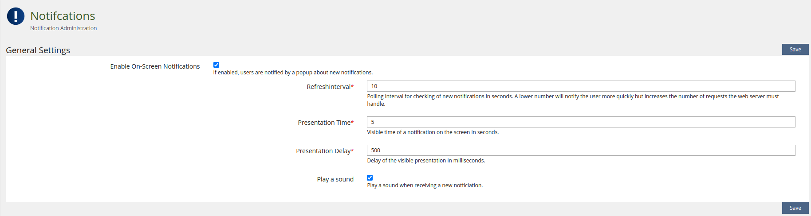

# Notifications

The key words “MUST”, “MUST NOT”, “REQUIRED”, “SHALL”, “SHALL NOT”, “SHOULD”,
“SHOULD NOT”, “RECOMMENDED”, “MAY”, and “OPTIONAL” in this document are to be
interpreted as described in [RFC 2119](https://www.ietf.org/rfc/rfc2119.txt).

**Table of Contents**
<!-- TOC -->

  - [ILIAS configuration](#ilias-configuration)
    - [General Settings](#general-settings)
      - [Enable on-screen notifications](#enable-on-screen-notifications)

<!-- /TOC -->

## ILIAS Configuration

### General Settings

#### Enable on-screen notifications

If enabled, users will be informed by pop-up notifications about certain events.

***Note**: Less time allows more timely notifications, but increases server load.*
