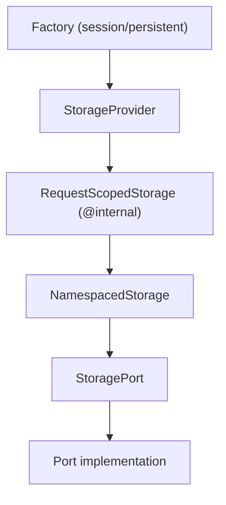
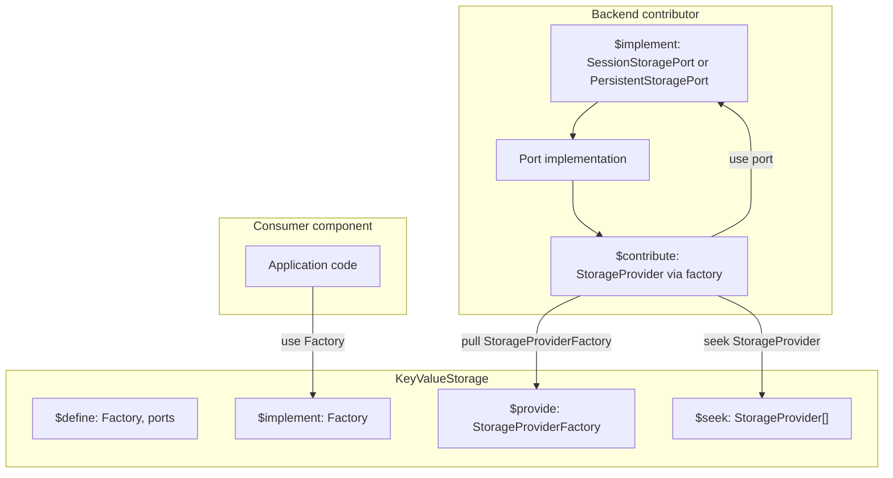
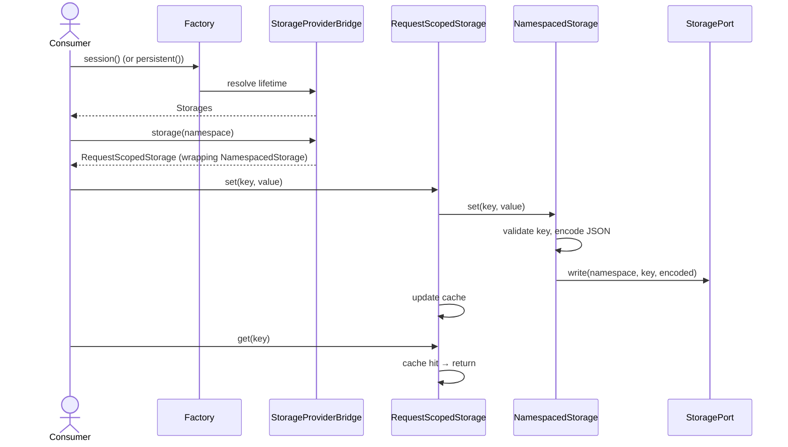
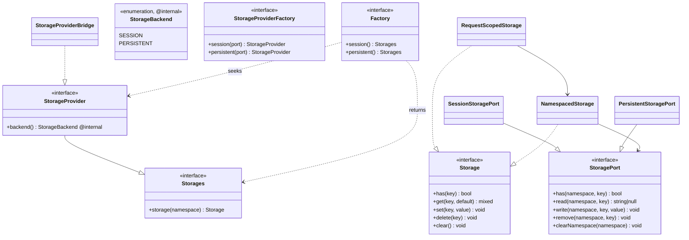

# KeyValueStorage

KeyValueStorage provides a unified **namespace-scoped key-value API** for
application state that MUST be retained until explicitly changed or cleared.

It is **not** a cache. Use `ILIAS\Cache` for derived, evictable performance data.

The component offers two storage lifetimes (**session** and **persistent**),
public consumer interfaces, and ports for backend contributors. It does **not**
implement persistence itself — that is contributed by other components.

The key words “MUST”, “MUST NOT”, “REQUIRED”, “SHALL”, “SHALL NOT”, “SHOULD”,
“SHOULD NOT”, “RECOMMENDED”, “MAY”, and “OPTIONAL” in this document are to be
interpreted as described in [RFC 2119](https://www.ietf.org/rfc/rfc2119.txt).

**Table of Contents**
* [General](#general)
  * [Audience](#audience)
* [Quick Start: Consumers](#quick-start-consumers)
* [Quick Start: Backend Providers](#quick-start-backend-providers)
* [Concepts](#concepts)
  * [Backends](#backends)
  * [Namespaces and Keys](#namespaces-and-keys)
  * [Per-User and Per-Subject Data](#per-user-and-per-subject-data)
  * [Value Encoding](#value-encoding)
  * [Request-Scoped Caching](#request-scoped-caching)
* [Choosing the Right Storage](#choosing-the-right-storage)
  * [KeyValueStorage vs Cache](#keyvaluestorage-vs-cache)
  * [KeyValueStorage vs ilSetting](#keyvaluestorage-vs-ilsetting)
* [Public API Reference](#public-api-reference)
  * [Factory](#factory)
  * [Storages](#storages)
  * [Storage](#storage)
  * [StorageNamespace](#storagenamespace)
  * [Defined Services](#defined-services)
  * [Other Public Types](#other-public-types)
* [Backend Provider Reference](#backend-provider-reference)
  * [StoragePort Contract](#storageport-contract)
  * [StorageProvider Contribution](#storageprovider-contribution)
  * [Layer Stack](#layer-stack)
* [Component Integration](#component-integration)
  * [Runtime Sequence](#runtime-sequence)
  * [Class Structure](#class-structure)
* [Component Layout](#component-layout)
* [Error Handling](#error-handling)
* [PSR Alignment](#psr-alignment)
* [Design Decisions](#design-decisions)
  * [ADR 0001 — Storage Lifetime Is a Curated, Internal Taxonomy](#adr-0001--storage-lifetime-is-a-curated-internal-taxonomy)
* [Tests](#tests)

## General

Consumers obtain a `Storage` instance from the contributed `Factory` by choosing a
lifetime (`session()` or `persistent()`) and a namespace, then read or write
values through a PSR-16-shaped API.

Backend providers implement a storage port in their component, contribute a
`StorageProvider`, and own any setup or schema required by their persistence
mechanism.

### Audience

| Role | Start Here |
|---|---|
| **Consumer** (feature/component code storing state) | [Quick Start: Consumers](#quick-start-consumers) |
| **Backend Provider** (component owning persistence) | [Quick Start: Backend Providers](#quick-start-backend-providers) |

## Quick Start: Consumers

Obtain a `Storage` instance from the contributed `Factory` by selecting a lifetime
and a namespace, then use the PSR-16-shaped API:

```php
use ILIAS\KeyValueStorage\Factory;
use ILIAS\KeyValueStorage\Storage;
use ILIAS\KeyValueStorage\StorageNamespace;

/** @var Factory $factory */ // $use[ILIAS\KeyValueStorage\Factory::class]

$storage = $factory->session()->storage(
    new StorageNamespace('my_component.view_state')
);

$storage->set('sort_column', 'title');
$storage->set('filters', ['status' => 'open', 'limit' => 10]);

if ($storage->has('sort_column')) {
    $column = $storage->get('sort_column', 'id');
}

$storage->delete('sort_column');
$storage->clear(); // all keys in this namespace only
```

**Choose the Lifetime**

| Need | Accessor |
|---|---|
| State tied to the current user session | `$factory->session()` |
| State that survives session boundaries | `$factory->persistent()` |

Both accessors return a `Storages` object exposing `storage()`. The underlying
backend identifier is an implementation detail and not part of the consumer API.

Consumers SHOULD choose **one namespace per feature area** — see
[Namespaces and Keys](#namespaces-and-keys). Use a stable, unique identifier
(e.g. `my_component.view_state`).

**Storable Values** — scalars, arrays, `null`, and objects implementing
`JsonSerializable`. See [Value Encoding](#value-encoding).

If the requested lifetime has no contributing backend, `Factory::session()` and
`Factory::persistent()` MUST raise `StorageNotAvailableException`.

## Quick Start: Backend Providers

To supply a backend:

1. **Implement** `SessionStoragePort` or `PersistentStoragePort` in your component
   (transport opaque encoded strings; see [StoragePort Contract](#storageport-contract)).
2. **`$implement`** the port interface pointing to your implementation.
3. **`$contribute`** a `StorageProvider` via `StorageProviderFactory`.
4. Own **setup/schema** for your persistence mechanism in your component.

**Session Backend**

```php
// MyComponent.php — init()

$implement[KeyValueStorage\SessionStoragePort::class] = static fn() =>
    $internal[MyComponent\KeyValueStorage\MySessionStoragePort::class];

$contribute[KeyValueStorage\StorageProvider::class] = static fn() =>
    $pull[KeyValueStorage\StorageProviderFactory::class]->session(
        $use[KeyValueStorage\SessionStoragePort::class]
    );

$internal[MyComponent\KeyValueStorage\MySessionStoragePort::class] = static fn() =>
    new MyComponent\KeyValueStorage\MySessionStoragePort(/* dependencies */);
```

**Persistent Backend**

```php
$implement[KeyValueStorage\PersistentStoragePort::class] = static fn() =>
    $internal[MyComponent\KeyValueStorage\MyPersistentStoragePort::class];

$contribute[KeyValueStorage\StorageProvider::class] = static fn() =>
    $pull[KeyValueStorage\StorageProviderFactory::class]->persistent(
        $use[KeyValueStorage\PersistentStoragePort::class]
    );

$internal[MyComponent\KeyValueStorage\MyPersistentStoragePort::class] = static fn() =>
    new MyComponent\KeyValueStorage\MyPersistentStoragePort(/* dependencies */);
```

Each contributed `StorageProvider` SHOULD target a **distinct** lifetime (session or
persistent). If two providers share a lifetime, the last contribution wins — see
[Backends](#backends). Providers MUST NOT reimplement validation, encoding, or
request caching — use `StorageProviderFactory` to obtain a fully wired provider.

Full details: [Backend Provider Reference](#backend-provider-reference).

## Concepts

### Backends

| Lifetime | Consumer Accessor | Port | Factory Method | Typical Lifetime |
|---|---|---|---|---|
| Session | `Factory::session()` | `SessionStoragePort` | `StorageProviderFactory::session()` | Current user session |
| Persistent | `Factory::persistent()` | `PersistentStoragePort` | `StorageProviderFactory::persistent()` | Until changed or cleared |

KeyValueStorage defines ports and seeks `StorageProvider` contributions. Concrete
persistence lives in contributing components. Lifetime wiring is internal; backend
providers use `StorageProviderFactory::session()` / `persistent()` and never reference
`StorageBackend` directly. Implementation details and contributor-specific design
decisions are documented in the contributing components.

**Multiple Providers for the Same Lifetime** — each lifetime is served by exactly
one provider. The factory indexes contributions by their backend, so if more than
one provider is contributed for the same lifetime, the **last contribution wins**
(deterministic by contribution order). This makes deliberate overrides possible
(a component replacing the default persistent backend), but contributing two
*unrelated* providers for the same lifetime is a configuration error and SHOULD be
avoided — there is no merging or fallback between backends of the same lifetime.

### Namespaces and Keys

**Namespaces** isolate keys between consumers within the same backend.

```php
new StorageNamespace('my_component.view_state');
```

Format: dot-separated lowercase identifier, starting with a letter.

```
my_component.view_state
ui.table
export.job
```

Invalid: empty string, uppercase, leading digits (`1invalid`), hyphens, more than
`StorageNamespace::MAX_LENGTH` (128) characters.

For the persistent backend, the combined namespace and keyword length MUST fit within
`StorageIdentifierLimits::MAX_UTF8MB4_INNODB_PRIMARY_KEY_CHARACTERS` (768 characters
under utf8mb4 on modern InnoDB; 128 + 255 = 383 today).

**Keys** follow [PSR-16](https://www.php-fig.org/psr/psr-16/) rules (enforced by
`KeyValidator` on every `Storage` operation):

- Non-empty string, at most `KeyValidator::MAX_LENGTH` (255) characters
- MUST NOT contain `{}()/\@:` (PSR-16 reserved characters)

`clear()` removes all keys for the **current namespace only**.

### Per-User and Per-Subject Data

KeyValueStorage does **not** attach a subject (user, role, object) to stored values.
The session backend is implicitly scoped to the current user session, but the
**persistent backend is global**. Consumers that persist values for a specific
subject — e.g. a user's UI preferences — MUST encode that subject into the
namespace or key themselves.

```php
// Subject in the KEY — one namespace holds keys for many users:
$storage = $factory->persistent()->storage(
    new StorageNamespace('my_component.user_prefs')
);
$storage->set("u{$user_id}.collapsed_panels", $panels);

// Subject in the NAMESPACE — clear() then wipes exactly one user at once:
$storage = $factory->persistent()->storage(
    new StorageNamespace("my_component.user_prefs.u{$user_id}")
);
$storage->clear(); // removes only this user's preferences
```

Encode the subject in the **key** when a single namespace serves many subjects, and
in the **namespace** when you want `clear()` to remove all of one subject's keys at
once. Namespace segments MUST start with a letter, so numeric ids MUST be prefixed
(e.g. `u{$user_id}`). Mind the length limits (namespace 128, key 255 characters) when
composing identifiers from subject ids.

### Value Encoding

Consumers pass native PHP values to `Storage`. Before data reaches a port,
`NamespacedStorage` encodes via `ValueCodec`:

| Type | Supported |
|---|---|
| `null`, `bool`, `int`, `float`, `string` | yes |
| `array` (nested; string or int keys) | yes |
| `JsonSerializable` | yes — output of `jsonSerialize()` MUST be JSON-compatible |
| other `object` / `resource` | **no** — `InvalidArgumentException` on `set` |

Encoding uses `json_encode()`; decoding uses `json_decode(..., true)`. PHP
`serialize()` / `unserialize()` MUST NOT be used — no object instantiation on
read. Invalid stored JSON MUST raise `InvalidStoragePayloadException`.

Example stored payload for an array:

```json
{"sort":"title","direction":"asc","count":3}
```

Ports see **opaque encoded strings** only.

### Request-Scoped Caching

An in-request (first-level) write-through cache is applied **internally** when a
backend provider registers through `StorageProviderFactory`. Consumers and
contributors choose only the lifetime and port; they do not configure request caching.

`RequestScopedStorage` memoizes reads and writes through for the duration of one
HTTP request, avoiding repeated port access within the same request. Cache scope:
`{backend}:{namespace}` (e.g. `session:ui.table`).

Cross-request caching is **out of scope** — use `ILIAS\Cache`.

| Operation | Behaviour |
|---|---|
| `get` | Cache miss: read port, populate cache. Hit: return cached value. |
| `set` | Write to port and update cache. |
| `delete` | Delete from port and remove from cache. |
| `clear` | Clear port namespace and drop cache bucket. |

## Choosing the Right Storage

### KeyValueStorage vs Cache

| Concern | KeyValueStorage | Cache (`ILIAS\Cache`) |
|---|---|---|
| Purpose | Application state | Performance optimisation |
| Durability | Retained until changed | May be evicted anytime |
| TTL | Backend-specific | First-class |
| Typical data | Wizard state, UI preferences | Query results, language strings |

Consumers MUST use KeyValueStorage for application state and MUST NOT treat it
as a cache. Use `ILIAS\Cache` when data MAY be discarded without functional impact.

### KeyValueStorage vs ilSetting

| Concern | KeyValueStorage | `ilSetting` |
|---|---|---|
| Purpose | Component-owned runtime state | Installation and module configuration |
| Data shape | JSON-encoded PHP values | Scalar strings |
| Identification | Namespace + key | Module + keyword |
| Typical use | Developer-controlled state | Legacy configuration API |

Consumers SHOULD use KeyValueStorage for runtime state, structured values, and
session scope. Use `ilSetting` for existing module configuration accessed via
the `ilSetting` API (module + keyword).

There is **no plan to replace `ilSetting`**. Consumers MUST NOT migrate existing
`ilSetting` entries unless a functional redesign explicitly moves configuration
to runtime state.

## Public API Reference

### Factory

```php
interface Factory
{
    public function session(): Storages;

    public function persistent(): Storages;
}
```

Defined via `$define`, implemented by KeyValueStorage. Consumers `$use` this interface.

| Method | Returns |
|---|---|
| `session()` | `Storages` for the session-scoped lifetime |
| `persistent()` | `Storages` for the durable lifetime |

Both raise `StorageNotAvailableException` if no backend contributed the lifetime.

### Storages

```php
interface Storages
{
    public function storage(StorageNamespace $namespace): Storage;
}
```

Returned by `Factory::session()` / `Factory::persistent()`.

| Method | Returns |
|---|---|
| `storage()` | Namespace-scoped storage (with internal in-request caching) |

### Storage

Namespace-scoped consumer interface (PSR-16 operation shape, not a cache):

| Method | Description |
|---|---|
| `has(string $key): bool` | Key exists in this namespace |
| `get(string $key, mixed $default = null): mixed` | Read value or default |
| `set(string $key, mixed $value): void` | Write value |
| `delete(string $key): void` | Remove one key |
| `clear(): void` | Remove all keys in this namespace |

All key operations validate via `KeyValidator` and encode/decode via `ValueCodec`.

### StorageNamespace

Value object with `value(): string` and `Stringable`. Validated on construction.
Maximum length: `StorageNamespace::MAX_LENGTH` (128).

### KeyValidator

Validates storage keys on every `Storage` operation. Maximum length:
`KeyValidator::MAX_LENGTH` (255). Enforces PSR-16 reserved-character rules.

### Defined Services

| Interface | Role |
|---|---|
| `ILIAS\KeyValueStorage\Factory` | Consumer entry point (`$define`) |
| `ILIAS\KeyValueStorage\SessionStoragePort` | Implemented by session contributor (`$define`) |
| `ILIAS\KeyValueStorage\PersistentStoragePort` | Implemented by persistent contributor (`$define`) |
| `ILIAS\KeyValueStorage\StorageProviderFactory` | Builds backend contributions (`$provide`) |

### Other Public Types

| Type | Role |
|---|---|
| `Storages` | Lifetime accessor returned by `Factory` (`storage()`) |
| `StorageProvider` | Contribution interface for backends (`extends Storages`) |
| `StoragePort` | Low-level port (opaque strings) |
| `KeyValidator` | PSR-16 key rules and length limit (for port authors sharing validation) |
| `StorageIdentifierLimits` | Shared utf8mb4 InnoDB primary-key character ceiling (768) |
| `ValueCodec` | JSON encode/decode (used internally by `NamespacedStorage`) |

## Backend Provider Reference

### StoragePort Contract

Port implementations MUST transport **opaque encoded strings**. They MUST NOT
encode or decode PHP values — `NamespacedStorage` handles that.

```php
interface StoragePort
{
    public function has(StorageNamespace $namespace, string $key): bool;

    public function read(StorageNamespace $namespace, string $key): ?string;

    public function write(StorageNamespace $namespace, string $key, string $value): void;

    public function remove(StorageNamespace $namespace, string $key): void;

    public function clearNamespace(StorageNamespace $namespace): void;
}
```

`SessionStoragePort` and `PersistentStoragePort` extend `StoragePort` as marker
interfaces — choose the one matching your backend's lifetime semantics.

**Implementor Guidelines**

- Data MUST be isolated by `StorageNamespace` — MUST NOT mix namespaces in storage keys.
- Stored strings MUST be treated as opaque; ports MUST NOT parse JSON.
- `read()` MUST return `null` when the key is absent.
- `clearNamespace()` MUST remove all keys for one namespace only.
- Ports MUST NOT call `$DIC` — inject dependencies via constructor.

### StorageProvider Contribution

Contributors register a `StorageProvider` through `StorageProviderFactory`, which
wires validation, encoding, namespace delegation, and the internal request cache.

**Provided by KeyValueStorage (`$provide`, Pulled by Contributors)**

| Class | Role |
|---|---|
| `StorageProviderFactory` | Builds a `StorageProvider` via `session()` / `persistent()` |

**Contributor Checklist**

- [ ] Port implements `SessionStoragePort` or `PersistentStoragePort`
- [ ] `$implement[Port]` wired to port instance
- [ ] `$contribute[StorageProvider]` via `$pull[StorageProviderFactory]->session()` or `->persistent()`
- [ ] One provider per lifetime (a duplicate silently overrides — last wins)
- [ ] Setup/schema owned by contributing component (if persistent storage needs tables)

### Layer Stack



| Layer | Responsibility |
|---|---|
| `StorageProviderFactory` | Build `StorageProvider` contributions from a port |
| `Implementation\Factory` | Resolve `StorageProvider` (a `Storages`) by lifetime (O(1) lookup) |
| `StorageProviderBridge` | `@internal` wire port → public `StorageProvider` |
| `RequestScopedStorage` | `@internal` request-local write-through cache |
| `NamespacedStorage` | Key validation, JSON encoding, namespace delegation |
| Your port | Opaque string persistence |

## Component Integration

KeyValueStorage wiring (`KeyValueStorage.php`):

| Mechanism | Entry |
|---|---|
| `$define` | `Factory`, `SessionStoragePort`, `PersistentStoragePort` |
| `$implement` | `Factory` → `Implementation\Factory` |
| `$provide` | `StorageProviderFactory` |
| `$seek` | `StorageProvider[]` (from contributors) |



### Runtime Sequence



### Class Structure



## Component Layout

```
components/ILIAS/KeyValueStorage/
├── KeyValueStorage.php
├── README.md
├── maintenance.json
├── src/
│   ├── Factory.php
│   ├── Storages.php
│   ├── Storage.php
│   ├── StorageProvider.php
│   ├── StorageProviderFactory.php
│   ├── StoragePort.php
│   ├── SessionStoragePort.php
│   ├── PersistentStoragePort.php
│   ├── StorageNamespace.php
│   ├── StorageIdentifierLimits.php
│   ├── KeyValidator.php
│   ├── ValueCodec.php
│   ├── Exception/
│   │   ├── StorageNotAvailableException.php
│   │   └── InvalidStoragePayloadException.php
│   └── Implementation/
│       ├── Factory.php
│       ├── NamespacedStorage.php
│       ├── NamespacedStorageFactory.php
│       ├── RequestScopeCache.php
│       ├── RequestScopedStorage.php
│       ├── StorageBackend.php
│       ├── StorageProviderFactory.php
│       └── StorageProviderBridge.php
└── tests/
```

## Error Handling

| Situation | Exception | When |
|---|---|---|
| Backend not contributed | `StorageNotAvailableException` | `Factory::session()` / `Factory::persistent()` |
| Invalid namespace (format or length) | `\InvalidArgumentException` | `new StorageNamespace(…)` |
| Invalid key (format or length) | `\InvalidArgumentException` | Any `Storage` operation |
| Non-JSON stored value | `InvalidStoragePayloadException` | `ValueCodec::decode()` |
| Non-JSON-serializable value | `\InvalidArgumentException` | `Storage::set()` / encode |

`StorageNotAvailableException` extends `\LogicException` — missing integration
wiring, not an end-user error.

## PSR Alignment

The `Storage` interface follows the operation shape of
[PSR-16 (Simple Cache)](https://www.php-fig.org/psr/psr-16/). Key validation
uses PSR-16 reserved-character rules via `KeyValidator`.

This component **does not** implement `Psr\SimpleCache\CacheInterface` to avoid
overlap with `ILIAS\Cache` and to keep TTL/eviction out of application-state storage.

## Design Decisions

Significant architecture decisions are recorded as lightweight
[Architecture Decision Records](https://github.com/joelparkerhenderson/architecture-decision-record)
(Michael Nygard's *Context / Decision / Consequences* format, as adopted by many
applications and frameworks). Records are append-only: supersede rather than rewrite.

### ADR 0001 — Storage Lifetime Is a Curated, Internal Taxonomy

**Status:** Accepted.

**Context.** The component offers exactly two storage lifetimes (session and
persistent). Consumers SHOULD NOT have to understand or depend on that taxonomy to
read and write state, whereas backend providers (an SPI audience) MUST declare which
lifetime they fulfil. The set of lifetimes is small and stable, and each lifetime is
already represented by a marker port (`SessionStoragePort` / `PersistentStoragePort`).

**Decision.** Model the lifetime as a string enum `StorageBackend` in
`Implementation/` (marked `@internal`). Consumers select a lifetime through
`Factory::session()` / `Factory::persistent()`. Backend providers contribute via
`StorageProviderFactory::session()` / `persistent()` and never reference the enum.
The lifetime is expressed both by the marker port and by the internal enum value.

**Consequences.**

- **+** The consumer API stays minimal and discoverable; no enum knowledge is required, and the only consumer-visible vocabulary is "session" vs "persistent".
- **+** Backend providers use typed factory methods aligned with marker ports — no `StorageBackend` in contributor wiring.
- **+** The taxonomy is curated and centralised — its semantics are owned by a single component rather than scattered across contributors.
- **−** Adding a new lifetime requires editing KeyValueStorage. This is acceptable: lifetimes are a rare, deliberate domain decision, not an open extension point.
- **−** The lifetime is encoded twice (marker port + enum); `StorageProviderFactory` keeps the two consistent.

**Revisit when** a third lifetime or externally-defined backend lifetimes become
necessary. The alternative is to split the SPI into dedicated
`SessionStorageProvider` / `PersistentStorageProvider` interfaces resolved by type,
removing both the enum and `StorageProvider::backend()` from the contribution surface.

## Tests

PHPUnit tests in `components/ILIAS/KeyValueStorage/tests/`:

- `FactoryTest` — lifetime resolution (`session()`/`persistent()`), missing backend
- `StorageProviderFactoryTest` — contributor factory wires internal request cache
- `StorageProviderBridgeTest` — internal request cache, write-through, backend
- `StorageNamespaceTest`, `KeyValidatorTest`, `StorageIdentifierLimitsTest` — validation rules
- `ValueCodecTest` — JSON encoding, payload errors, `JsonSerializable`
- `NamespacedStorageTest` — port interaction, encoding
- `RequestScopedStorageTest` — request cache semantics
- `InvalidStoragePayloadExceptionTest`, `StorageNotAvailableExceptionTest`

Run:

```bash
phpunit components/ILIAS/KeyValueStorage/tests/
```
