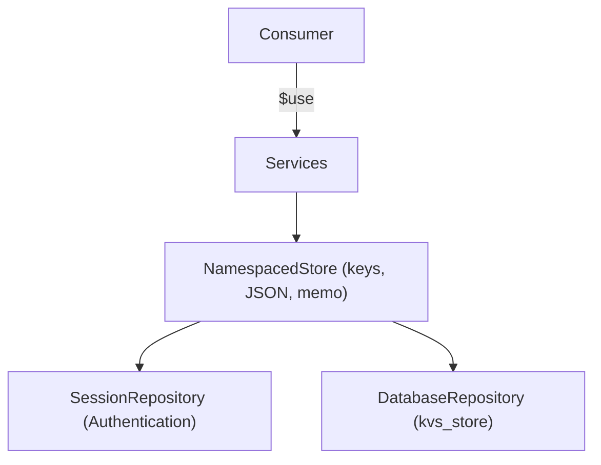

# KeyValueStorage

KeyValueStorage keeps **application state** under a namespace and a key: the sort
column of a table, the step a wizard is on, the panels a screen has collapsed.

It is **not** a cache. Values are kept until they are changed or cleared. Use
`ILIAS\Cache` for anything that may be dropped at any moment without breaking a
feature.

## Storing and reading state

Consumers use `ILIAS\KeyValueStorage\Services` and pick a scope. The namespace is
a list of segments, the delimiter is an internal detail:

```php
use ILIAS\KeyValueStorage\Services;

/** @var Services $storage */ // $use[ILIAS\KeyValueStorage\Services::class]

$store = $storage->session(['my_component', 'view_state']);

$store->set('sort_column', 'title');
$store->set('filters', ['status' => 'open', 'limit' => 10]);

$column = $store->get(
    'sort_column',
    $DIC->refinery()->byTrying([
        $DIC->refinery()->kindlyTo()->string(),
        $DIC->refinery()->always('id'),
    ])
);
$store->has('filters');
$store->delete('sort_column');
$store->clear();          // only this namespace
```

`get()` always takes a Refinery `Transformation`, like the HTTP request wrappers.
Absent keys are passed to the transformation as `null`.

| Scope | Lives | Accessor |
|---|---|---|
| Session | until the session ends | `Services::session()` |
| Persistent | until changed or cleared | `Services::persistent()` |

`persistent()` has **no subject**: one value per namespace and key for the whole
installation. Per-user state is not supported yet, see
[What is missing](#what-is-missing).

### Namespaces

One namespace per feature area, passed as segments. Segments are joined with `.`
internally. A segment must not be empty and must not contain `.`, `:` or control
characters (those break composition). The joined value is at most
`Internal\StorageNamespace::MAX_LENGTH` (128) characters:

```php
['my_component', 'view_state']
['ui', 'storage']
['export', 'job']
```

### Keys

Non-empty, at most `KeyRules::MAX_LENGTH` (255) characters, no colon and no
control characters. The colon is what separates namespace from key when a
repository composes both into one identifier.

Everything else is allowed on purpose: keys are handed in by consumers and are
often derived from class names - the UI, for instance, stores its view control
state under ids like
`ILIAS\UI\Implementation\Component\Table\Data_my_table`.

### Values

`null`, scalars, arrays of those, and objects implementing `JsonSerializable`.

Values are stored as JSON. `serialize()` / `unserialize()` are never used, so
reading a value can never instantiate an object. An object handed to `set()`
therefore reads back as the array `json_encode()` made of it - within the same
request as well as in the next one.

Anything else raises `\InvalidArgumentException`. A stored value that cannot be
decoded anymore raises `InvalidStoredValueException`.

### Reading twice is free

A store remembers what it has read or written during the request, so reading the
same key twice does not touch the session or the database twice. This is not a
cross-request cache.

## What to use when

| | KeyValueStorage | `ILIAS\Cache` | `ilSetting` | `ILIAS\User\Settings` |
|---|---|---|---|---|
| Holds | application state | derived data | installation config | user profile settings |
| Lost when | never, until cleared | any time | never | never |
| Shape | JSON | any | string | string |
| Scoped by | namespace | container | module | user |
| Declared | no | no | no | yes, one `SettingDefinition` each |

`ILIAS\User\Settings` (backed by `usr_pref`) is a **declared** registry: every
entry is a form field on the personal settings page with its own visibility and
export flags. It is not a place for free-form state.

There is no plan to replace `ilSetting`. Do not migrate existing settings.

## Contributing the session backend

`Repository` is the persistence contract of one scope. It moves opaque strings;
validating keys and encoding values happens above it.

```php
interface Repository
{
    public function has(Internal\StorageNamespace $namespace, string $key): bool;
    public function read(Internal\StorageNamespace $namespace, string $key): ?string;
    public function write(Internal\StorageNamespace $namespace, string $key, string $value): void;
    public function remove(Internal\StorageNamespace $namespace, string $key): void;
    public function removeAll(Internal\StorageNamespace $namespace): void;
}
```

This component stores the persistent scope itself, in the table it owns. The
session scope it cannot: the session belongs to `Authentication`. So
`SessionRepository` is declared here and implemented there:

```php
// Authentication.php
$implement[KeyValueStorage\SessionRepository::class] = static fn() =>
    new Authentication\KeyValueStorage\SessionRepository();
```

An implementation must keep the namespaces apart, must return `null` from
`read()` for an absent key, must leave every other namespace alone in
`removeAll()`, and must not look at the values.

## Wiring

| | |
|---|---|
| `$define` | `Services`, `SessionRepository` |
| `$implement` | `Services` |
| `$pull` | `ILIAS\Database\Connection`, `ILIAS\Refinery\Factory` (setup agent) |
| `$contribute` | `ILIAS\Setup\Agent` |



## Layout

```
components/ILIAS/KeyValueStorage/
├── KeyValueStorage.php
├── README.md
├── PRIVACY.md
├── ROADMAP.md
├── src/
│   ├── Services.php               consumer entry point
│   ├── Store.php                  one namespace
│   ├── Repository.php             backend contract
│   ├── SessionRepository.php      implemented by Authentication
│   ├── Exception/
│   │   └── InvalidStoredValueException.php
│   ├── Internal/
│   │   ├── StorageServices.php
│   │   ├── NamespacedStore.php
│   │   ├── StorageNamespace.php
│   │   ├── DatabaseRepository.php
│   │   ├── KeyRules.php
│   │   └── Values.php
│   └── Setup/
│       ├── Agent.php
│       └── DBUpdateSteps.php
└── tests/
```

Everything under `Internal/` is an implementation detail and may change without
notice.

### The table

`kvs_store`, primary key `(namespace, keyword)`, `value` as CLOB. `removeAll()`
is one indexed `DELETE`. The column lengths in the update step are literals: a
step describes a change that already happened and must not move when a
validation limit moves.

## Errors

| Situation | Exception |
|---|---|
| Invalid namespace | `\InvalidArgumentException` |
| Invalid key | `\InvalidArgumentException` |
| Value cannot be stored | `\InvalidArgumentException` |
| Stored value cannot be read back | `InvalidStoredValueException` |

## What is missing

**Per-user state.** `persistent()` is global. Encoding a user id into the
namespace or the key is *not* a supported workaround: such rows cannot be found
or removed when the account is deleted, which is both a leak and a GDPR problem.

The way forward is a scope of its own, with the subject as a parameter rather
than as part of the key:

```php
$storage->forUser($user_id, ['my_component', 'view_state']);
```

backed by a table with `usr_id` in its primary key, contributed by `User`, which
clears it on the existing `deleteUser` event. Until that exists, keep per-user
state in the session scope.

**Listing keys.** A store cannot enumerate what it holds.

## Tests

```bash
phpunit components/ILIAS/KeyValueStorage/tests/
```
