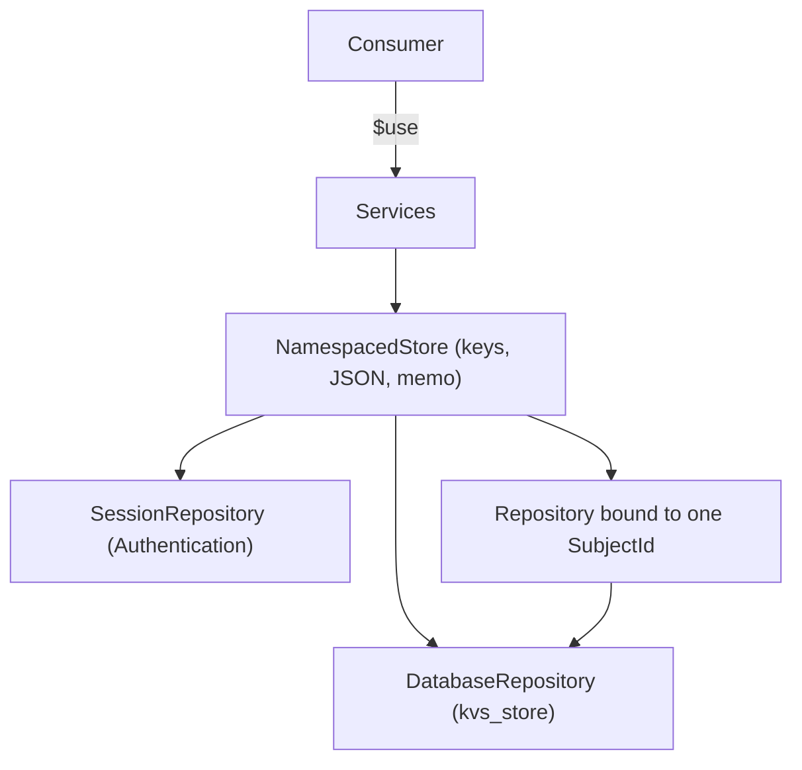

# KeyValueStorage

KeyValueStorage keeps **application state** under a namespace and a key: the sort
column of a table, the step a wizard is on, the panels a screen has collapsed.

It is **not** a cache. Values are kept until they are changed or cleared. Use
`ILIAS\Cache` for anything that may be dropped at any moment without breaking a
feature.

## Storing and reading state

Consumers use `ILIAS\KeyValueStorage\Services` and pick a scope. The namespace is
a list of segments, the delimiter is an internal detail:

```php
use ILIAS\KeyValueStorage\Services;

/** @var Services $storage */ // $use[ILIAS\KeyValueStorage\Services::class]

$store = $storage->session(['my_component', 'view_state']);

$store->set('sort_column', 'title');
$store->set('filters', ['status' => 'open', 'limit' => 10]);

$column = $store->get(
    'sort_column',
    $DIC->refinery()->byTrying([
        $DIC->refinery()->kindlyTo()->string(),
        $DIC->refinery()->always('id'),
    ])
);
$state = $store->getMany([
    'sort_column' => $DIC->refinery()->byTrying([
        $DIC->refinery()->kindlyTo()->string(),
        $DIC->refinery()->always('id'),
    ]),
    'filters' => $DIC->refinery()->byTrying([
        $DIC->refinery()->identity(),
        $DIC->refinery()->always([]),
    ]),
]);
$store->keys();
$store->has('filters');
$store->delete('sort_column');
$store->clear();          // only this namespace
```

`get()` always takes a Refinery `Transformation`, like the HTTP request wrappers.
Absent keys are passed to the transformation as `null`.

`getMany()` is the same contract for several known keys: each key keeps its own
transformation, the result has those keys in the given order, and extra keys
the namespace happens to hold are left out. One backend read loads the whole
namespace, so later `get()`, `has()` and `keys()` calls do not hit it again.

`keys()` lists what the namespace currently holds. Use it to inspect or clean
up; do not use it as a prelude to N times `get()` if you already know the keys.

| Scope | Lives | Accessor |
|---|---|---|
| Session | until the session ends | `Services::session()` |
| Persistent | until changed or cleared, one value for the installation | `Services::persistent()` |
| Subject | until changed, cleared, or the subject is purged | `Services::persistentFor()` |

`persistent()` has **no subject**: one value per namespace and key for the whole
installation. Those rows live in `kvs_store` with an empty `subject`.
`persistentFor()` takes a `SubjectResolver` and stores that subject's values in
the same table, distinguished by the `subject` column. The subject is a
parameter, never part of the namespace or the key. An anonymous subject cannot
be persisted; keep that state in the session scope.

```php
$mine = $storage->persistentFor($authenticated_user, ['my_component', 'view_state']);
$mine->set('sort_column', 'title');
```

`$authenticated_user` is `ILIAS\Authentication\Domain\AuthenticatedSubjectResolver`.
It reads `AuthenticatedUser::id()` and names the subject `u` plus the user id.
Authentication purges that subject when the account is deleted. Encoding a user
id into the namespace or the key is not a supported substitute: those rows cannot
be found on deletion.

### Namespaces

One namespace per feature area, passed as segments. Segments are joined with `.`
internally. A segment must not be empty and must not contain `.`, `:` or control
characters (those break composition). The joined value is at most
`Internal\StorageNamespace::MAX_LENGTH` (128) characters:

```php
['my_component', 'view_state']
['ui', 'storage']
['export', 'job']
```

### Keys

Non-empty, at most `KeyRules::MAX_LENGTH` (255) characters, no colon and no
control characters. The colon is what separates namespace from key when a
repository composes both into one identifier.

Everything else is allowed on purpose: keys are handed in by consumers and are
often derived from class names - the UI, for instance, stores its view control
state under ids like
`ILIAS\UI\Implementation\Component\Table\Data_my_table`.

### Values

`null`, scalars, arrays of those, and objects implementing `JsonSerializable`.

Values are stored as JSON via Refinery `encode()->json()` / `decode()->json()`.
`serialize()` / `unserialize()` are never used, so reading a value can never
instantiate an object. An object handed to `set()` therefore reads back as the
array the JSON round-trip produced - within the same request as well as in the
next one.

Anything else raises `\InvalidArgumentException`. A stored value that cannot be
decoded anymore raises `InvalidStoredValueException`.

### Reading twice is free

A store remembers what it has read or written during the request, so reading the
same key twice does not touch the session or the database twice. `keys()` and
`getMany()` remember the whole namespace. This is not a cross-request cache.

## What to use when

| | KeyValueStorage | `ILIAS\Cache` | `ilSetting` | `ILIAS\User\Settings` |
|---|---|---|---|---|
| Holds | application state | derived data | installation config | user profile settings |
| Lost when | never, until cleared | any time | never | never |
| Shape | JSON | any | string | string |
| Scoped by | namespace | container | module | user |
| Declared | no | no | no | yes, one `SettingDefinition` each |

`ILIAS\User\Settings` (backed by `usr_pref`) is a **declared** registry: every
entry is a form field on the personal settings page with its own visibility and
export flags. It is not a place for free-form state.

There is no plan to replace `ilSetting`. Do not migrate existing settings.

## Contributing the session backend

`Repository` is the persistence contract of one scope. It moves opaque strings;
validating keys and encoding values happens above it.

```php
interface Repository
{
    public function has(Internal\StorageNamespace $namespace, string $key): bool;
    public function read(Internal\StorageNamespace $namespace, string $key): ?string;
    /** @return array<string, string> */
    public function readAll(Internal\StorageNamespace $namespace): array;
    public function write(Internal\StorageNamespace $namespace, string $key, string $value): void;
    public function remove(Internal\StorageNamespace $namespace, string $key): void;
    public function removeAll(Internal\StorageNamespace $namespace): void;
}
```

This component stores the persistent scope itself, in the table it owns. The
session scope it cannot: the session belongs to `Authentication`. So
`SessionRepository` is declared here and implemented there:

```php
// Authentication.php
$implement[KeyValueStorage\SessionRepository::class] = static fn() =>
    new Authentication\KeyValueStorage\SessionRepository();
```

An implementation must keep the namespaces apart, must return `null` from
`read()` for an absent key, must return only that namespace from `readAll()`,
must leave every other namespace alone in `removeAll()`, and must not look at
the values.

## Wiring

| | |
|---|---|
| `$define` | `Services`, `SessionRepository`, `SubjectPurge` |
| `$implement` | `Services`, `SubjectPurge` |
| `$pull` | `ILIAS\Database\Connection`, `ILIAS\Refinery\Factory` |
| `$contribute` | `ILIAS\Setup\Agent` |


```mermaid
flowchart TB
    C["Consumer"] -->|"$use"| S["Services"]
    S --> ST["NamespacedStore (keys, JSON, memo)"]
    ST --> SR["SessionRepository (Authentication)"]
    ST --> DR["DatabaseRepository (kvs_store)"]
    ST --> BR["Repository bound to one SubjectId"]
    BR --> DR
```

## Layout

```
components/ILIAS/KeyValueStorage/
├── KeyValueStorage.php
├── README.md
├── PRIVACY.md
├── ROADMAP.md
├── src/
│   ├── Services.php               consumer entry point
│   ├── Store.php                  one namespace
│   ├── Repository.php             backend contract
│   ├── SubjectRepository.php      subject operations on the same table
│   ├── SubjectPurge.php           delete one subject's rows
│   ├── SessionRepository.php      implemented by Authentication
│   ├── Subject/
│   │   ├── Subject.php
│   │   ├── SubjectId.php
│   │   └── SubjectResolver.php
│   ├── Exception/
│   │   └── InvalidStoredValueException.php
│   ├── Internal/
│   │   ├── StorageServices.php
│   │   ├── NamespacedStore.php
│   │   ├── StorageNamespace.php
│   │   ├── DatabaseRepository.php
│   │   ├── BoundSubjectRepository.php
│   │   ├── DatabaseSubjectPurge.php
│   │   ├── KeyRules.php
│   │   └── Values.php
│   └── Setup/
│       ├── Agent.php
│       └── DBUpdateSteps.php
└── tests/
```

Everything under `Internal/` is an implementation detail and may change without
notice.

### The table

`kvs_store`, primary key `(subject, namespace, keyword)`, `value` as `TEXT` of
4000 characters. Global rows use the empty string as `subject`, which is not a
valid subject segment. Every query is an equality on `subject` first, then
optionally on `namespace` and `keyword`, so the key order matches the leftmost
prefix those statements can use. Purging a subject is `DELETE WHERE subject = ?`.
A global namespace scan is `WHERE subject = '' AND namespace = ?` and does not
read another subject's rows.

`subject` and `namespace` are 128 characters, `keyword` is 255. Under utf8mb4
that primary key is (128 + 128 + 255) × 4 = 2044 bytes. InnoDB with the DYNAMIC
row format ILIAS requires allows 3072 bytes, so the key fits. `value` is not
part of the key. A subject, namespace, key or serialized value longer than its
column is rejected before any statement is sent.

The column lengths in the update steps are literals: a step describes a change
that already happened and must not move when a validation limit moves.

## Errors

| Situation | Exception |
|---|---|
| Invalid namespace | `\InvalidArgumentException` |
| Invalid key | `\InvalidArgumentException` |
| Value cannot be stored, or exceeds 4000 characters | `\InvalidArgumentException` |
| Stored value cannot be read back | `InvalidStoredValueException` |
| `persistentFor()` without a named subject | `\InvalidArgumentException` |

## Tests

```bash
phpunit components/ILIAS/KeyValueStorage/tests/
```
