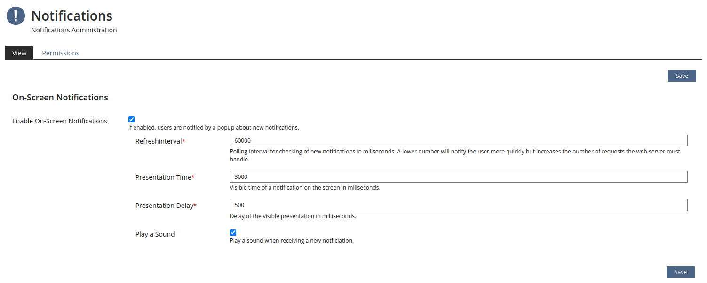

# Notifications

The key words “MUST”, “MUST NOT”, “REQUIRED”, “SHALL”, “SHALL NOT”, “SHOULD”,
“SHOULD NOT”, “RECOMMENDED”, “MAY”, and “OPTIONAL” in this document are to be
interpreted as described in [RFC 2119](https://www.ietf.org/rfc/rfc2119.txt).

**Table of Contents**
* [Setup](#setup)
  * [Legacy](#legacy)
* [Configuration](#ilias-configuration)
  * [General Settings](#general-settings)
    * [On-Screen Notifications](#on-screen-notifications)
* [Specifications](#specifications)
* [Correlations](#correlations)
  * [GS Toast](#gs-toast)
* [Bugs](#bugs)

## Setup

To provide your own Notifications to the UI, you need a notification provider.
You can find more information about the structure of such a provider [here](../../src/GlobalScreen/Scope/Notification/README.md).
This is the easiest way to provide simple notifications.

If you additionaly want to integrate your notifications into the notification system you can use said system by calling:

```php
$DIC->notifications()->system()->toUsers($config, $users, $async);
```

with an `ilNotificationsConfig` object, a list of user ids and a flag to mark async calls.

The config needs a type to be created. This type defines your notifications scope in which you are able to create and delete
notifications. You may use an existing type if communicated with the maintainer of its scope service. If given, the type used should be identical with the type of your `NotificationProvider`.

Furthermore you can set the following properties on your notification configuration:

- `$config->setTitleVar($title)` The title of your Notifications. The passed argument may be an ILIAS language variable.
  - The notification system will try to translate the title if a respective translation can be determined. Otherwise the passed string will be processed unmodified and finally passed to the output channels. If you want to translate it, you have the option
    to add an additional parameter for replaceables and another for a language module to load e.g. `$config->setTitleVar($title, [$username], 'usr')`
- `$config->setShortDescriptionVar($description)` The description for space limited presentations (e.g. popups). It translates the same as title.
- `$config->setLongDescriptionVar($description)` The full description (not used for OSD). It translates the same as title.
- `$config->setLinks($links)` A list of `ilNotificationLinks` to display as translated links below the description.
- `$config->setIconPath($path)` The path to the icon for your notifciation type. It will be displayed in the indent of the notification or at the top of groups of your notification type.
- `$config->setValidForSeconds($time)` The time will be visible for the user in target presentations.
- `$config->setIdentification($identification)` A unique `NotificationIdentification` that can be used to identify this particular notification case for future deletions.
- `$config->setHandlerParam($handler_name, $params)` Parameters to be passed to the handler for additional informations (not used for OSD).

You can remove a OSD notification by using the following functions within the `ilNotificationOSDHandler`:
- `removeOSDNotificationByIdentification($type, $identification)` This removes all notifications within your `$type` which are
  compatible with the `NotificationIdentification` given by `$identification`. Optional you may add a user id as parameter to remove
  this notification only for one user.
- OSD Notification will be removed automatically when the user clicks on the **X** within the notifications toast.

### Legacy

The use of the Notification Service for On-Screen Notifications with a real-time relevance  is **deprecated**.
The use of the [Toast](../../src/GlobalScreen/Scope/Toast/README.md) is mandatory.

## Configuration

### General Settings

#### On-Screen Notifications

If enabled, users will be notified of certain events by pop-up notifications in the form of toasts.

Further all numeric values have to be set and the sum of **Presentation Time** and **Presentation Delay** must be less than **Refreshinterval**.
Otherwise the setting will not be saved and an error will occur.
The **Play a Sound** will only be effective if it has not been disabled by the user in their personal settings.



If disabled, all sub.settings will be removed and all existing On-Screen Notifications will be cleared.

## Specifications

This service has no hard technical limit, but should be used with care as an exceptional number of notifications can
can disrupt the overall user experience of the site and may also exceed server-side limits.

Therefore the use of a reduced **Refreshinterval** is not recommended.

## Correlations

### GS Toast

The Notification correlates partially with the [GS Toast](../../src/GlobalScreen/Scope/Toast/README.md) in purpose and functionality.

- The Notification provides settings for the Component.
- The Component completely replaces the purpose of real-time relevant notifications of the **On Screen Display Notifications** notification type.

## Bugs

There is no way to identify and delete an OSD Notification for the provider. See the [ROADMAP](ROADMAP.md) for more details on this.
