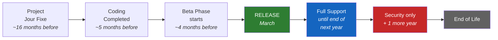
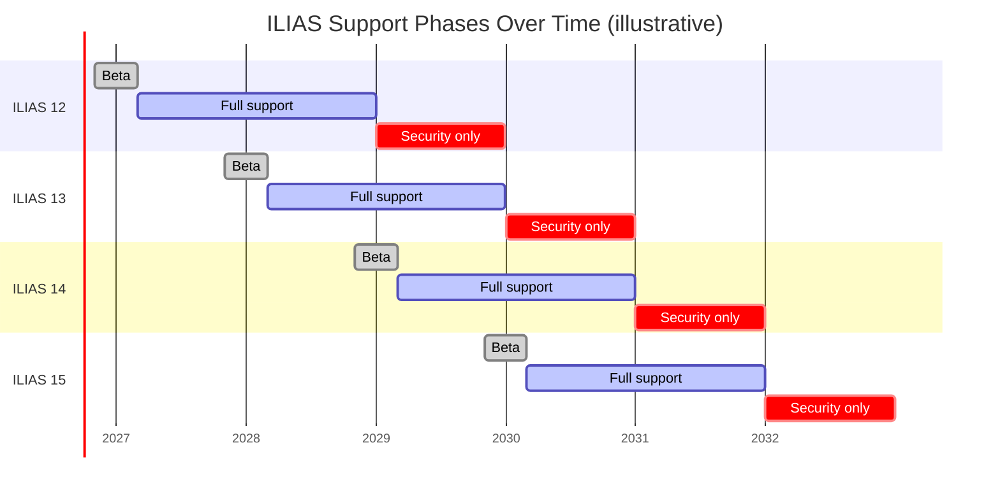
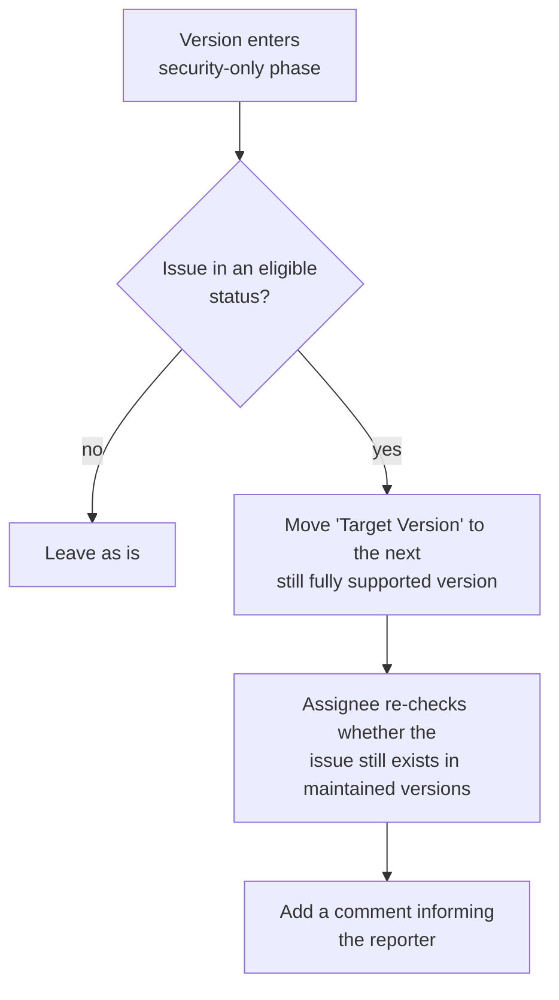

# Supported Versions

> **In a nutshell**
> A new ILIAS version is released roughly every year (usually in spring).
> After its release, each version goes through **two support phases**:
>
> 1. **Full support** – *every* reported issue may be fixed
>    (bugs, usability problems, security problems …).
> 2. **Security support** – *only security* issues are fixed.
>
> A simple rule of thumb:
> **Full support covers the release year plus the following year; after that
> comes one more year of security-only support.**
> Then the version reaches its end of life.

This document explains the exact rules, shows how several versions overlap over
time, and summarises what it means for the different people who work with ILIAS.

## How long is a version supported?

The two phases are defined precisely as follows:

| Phase                 | Lasts until …                                            | What gets fixed                          |
|-----------------------|----------------------------------------------------------|------------------------------------------|
| **Full support**      | the **end of the year *after* the release year**         | any kind of issue (bug, usability, security …) |
| **Security support**  | the **end of the following year** (one more year)        | security issues **only**                 |
| **End of life**       | after security support ends                              | nothing – please upgrade                 |

**Examples (ILIAS 10, released in 2025):**

* A **usability** issue reported in **August 2026** *is* eligible for a fix –
  ILIAS 10 is still in **full support** (until the end of 2026).
* A **security** issue reported in **August 2027** *is* eligible for a fix –
  ILIAS 10 is then in **security support** (until the end of 2027).
* A **crash / malfunction** reported in **August 2027** is **not** eligible –
  in the security phase only security issues are fixed.

## The life cycle of a single version

Every version passes through the same milestones. The months below are given
**relative to its release** (releases usually happen in **March**):

| Milestone               | When (relative to release) | Meaning                                              |
|-------------------------|----------------------------|------------------------------------------------------|
| Project Jour Fixe       | ~16 months before release  | Planning of the version starts                       |
| Coding Completed        | ~5 months before release   | No new features are added; stabilisation begins      |
| Start of Beta Phase     | ~4 months before release   | Testable pre-release available                       |
| **Release**             | **month 0 (March)**        | Full support starts                                  |
| End of Full Support     | December of *release year + 1* | Switch to security-only support                   |
| End of Security Support | December of *release year + 2* | End of life                                       |

From the first planning meeting to the end of security support, a version stays
active for **a little more than four years**.

### How consecutive versions overlap

A new version is already being planned and built while the previous one is still
supported, so **several life cycles run in parallel**. The table below is the
classic overview, but with concrete example versions instead of abstract
placeholders. It follows **ILIAS 12, 13 and 14** through every milestone.
Read it **top to bottom for time**; **each column is one version**
*(months are illustrative — the pattern repeats for every version)*:

| When       | ILIAS 12                 | ILIAS 13                 | ILIAS 14                 |
|------------|--------------------------|--------------------------|--------------------------|
| 2025, Nov  | Project Jour Fixe        |                          |                          |
| 2026, Oct  | Coding Completed         |                          |                          |
| 2026, Nov  | Start of Beta Phase      | Project Jour Fixe        |                          |
| 2027, Mar  | **Release**              |                          |                          |
| 2027, Oct  |                          | Coding Completed         |                          |
| 2027, Nov  |                          | Start of Beta Phase      | Project Jour Fixe        |
| 2028, Mar  |                          | **Release**              |                          |
| 2028, Oct  |                          |                          | Coding Completed         |
| 2028, Nov  |                          |                          | Start of Beta Phase      |
| 2028, Dec  | End of Full Support      |                          |                          |
| 2029, Mar  |                          |                          | **Release**              |
| 2029, Dec  | End of Security Support  | End of Full Support      |                          |
| 2030, Dec  |                          | End of Security Support  | End of Full Support      |
| 2031, Dec  |                          |                          | End of Security Support  |

### Which version is in which phase each year

The same information, but viewed **per calendar year** — this is usually the
question administrators and project managers actually ask: *"What is supported
**this** year?"*

| Year | ILIAS 12          | ILIAS 13          | ILIAS 14          |
|------|-------------------|-------------------|-------------------|
| 2026 | Beta (from Nov)   | –                 | –                 |
| 2027 | **Full support**  | Beta (from Nov)   | –                 |
| 2028 | **Full support**  | **Full support**  | Beta (from Nov)   |
| 2029 | Security only     | **Full support**  | **Full support**  |
| 2030 | End of life       | Security only     | **Full support**  |
| 2031 | End of life       | End of life       | Security only     |

Reading a single row shows the recurring pattern: in a typical year there are
**two versions in full support** plus **one older version in security-only
support**. For example, in **2029** both ILIAS 13 and ILIAS 14 are fully
supported, while ILIAS 12 only receives security fixes.

## Concrete example with real versions

To avoid abstract placeholders, here is how consecutive versions line up on the
calendar. *(Exact dates are illustrative; the binding rule is the two-phase
definition above.)*

| Version   | Released | Full support until | Security support until |
|-----------|----------|--------------------|------------------------|
| ILIAS 12  | 2027     | end of **2028**    | end of **2029**        |
| ILIAS 13  | 2028     | end of **2029**    | end of **2030**        |
| ILIAS 14  | 2029     | end of **2030**    | end of **2031**        |
| ILIAS 15  | 2030     | end of **2031**    | end of **2032**        |

Because the phases overlap, **several versions are supported at the same time**.
The Gantt chart below makes this visible — read it top to bottom (versions) and
left to right (years):

**Legend:** grey = beta / pre-release · blue = full support · red = security
only. Draw an imaginary vertical line at any year and you will usually cross
**two versions in full support** and **one version in security-only support**.

## What this means for you

Two very different groups work with these support phases. **Authorities** build
and safeguard ILIAS itself; **Users** run and operate ILIAS in their
organisations. Each group cares about a different part of the cycle.

### Authorities (Code, Concept, Test Case Curation, Security)

These are the roles responsible for *producing* and *safeguarding* the software.
Their key concern is **into how many versions a change has to flow**.

* **Code (maintainers / developers)**
  * A normal bug fix typically has to be applied to **three branches** — trunk
    plus the **two fully supported versions**.
  * Write fixes so they can be cleanly back-ported across these branches.

* **Concept (product & feature planning)**
  * Plan features around the milestones of the *upcoming* version — from
    *Project Jour Fixe* to *Coding Completed* (see the life-cycle chapter).

* **Test Case Curation**
  * You decide which scenarios, workflows and edge cases must be covered before a
    release can be considered safe. Your test cases should reflect what
    institutions actually do with ILIAS — not only what developers build.
  * The **Beta Phase** (from ~November before the March release) is when your
    curated test cases matter most: new and changed behaviour is available for
    verification, but the release is not yet final.

* **Security**
  * A security fix has the widest reach: it typically has to be applied to
    **four branches** — trunk plus the two fully supported versions **plus** the
    version that is still in security-only support.
  * Security is the *only* kind of fix that a version keeps receiving after it
    has left full support.

### Users (Organisation Administrators, Help Desk, Domain Experts)

These are the roles that *operate* ILIAS at an institution and support its
day-to-day use. Their key concern is **which version to run and when to upgrade**.

* **Organisation administrators (system operations)**
  * You have roughly **¾ of a year** to move to the next fully supported version
    before your current one leaves full support.
  * If you upgrade only every *other* version, you still stay within full
    support, but your planning runway across two cycles shrinks to about
    **1¾ years**.
  * Once a version is **security only**, plan the upgrade — normal bugs will no
    longer be fixed. After end of life, upgrade as soon as possible.

* **Help Desk / support staff**
  * Before promising/requesting a fix, check the version's phase:
    * **Full support** → any issue may be fixed.
    * **Security only** → only security issues are fixed; other reports are
      moved to a still fully supported version (see below).
    * **End of life** → the user must upgrade.

* **Domain experts of institutions**
  * You design and run e-learning scenarios (courses, assessments, collaboration
    workflows …) and often depend on **new ILIAS features** to realise them.
  * New features appear in the **upcoming release** — first in beta, then in the
    March release. Plan your scenarios around that rhythm: what you need may not
    exist in your current version yet.
  * If you stay on an older version (especially one in **security-only**
    support), you will **not** receive new features — only security fixes. To
    use new capabilities, your institution must upgrade to a fully supported
    version.
  * Use the beta phase to try out whether a planned scenario works with the new
    features before your institution upgrades.

## Transition to Security Support

When a version transitions from **full support** to **security support**
(at the end of the year), open issues in the Mantis bug tracker for this version
are handled as follows to ensure that reported problems are not lost:

1. **Eligibility for Transition**: All issues with the following status are
   considered: `open`, `unassigned`, `feedback`, `needs JF decision`,
   `postponed`, `funding needed`, `assigned`, `fixing acc to prio`.
2. **Automatic Target Version Update**: Instead of closing every issue, the
   "Target Version" of the issues should be incremented to the next still
   fully supported version.
3. **Responsibility of the "Assignee for Issues"**: The responsible "Assignee
   for Issues" is tasked with checking if the issue still persists in the
   maintained versions. They should not close the issue with a request for the
   reporter to re-test, unless there is a clear indication that the issue might
   have been fixed already.
4. **Communication**: When an issue is transitioned, a comment should be added
   to inform the reporter: "This current target version of this issue has
   entered the security-fix-only phase. We have moved this issue to the next
   maintained version for further investigation."

This applies to issues for ILIAS 10 or greater.
