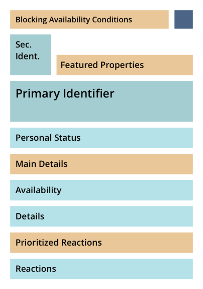

# UI Repository Item - Sorting and Highlighting Properties

## Starting point and goal

* Objects with **many properties in the repository are hard to read** because of high information density.
* This makes identifying the right object at a glance challenging and **slows down navigation.**
* Therefore, we propose a set of Semantic Groups and a priority system for **ordering item properties by intuitive understanding and relevance** to help the average user find what they are looking for with greater ease.

Soon the legacy repository item will have to be replaced by the UI Item ([Transfer Repository Objects to KS Items](https://docu.ilias.de/goto_docu_wiki_wpage_6409_1357.html)), which is a perfect opportunity to tweak the display of properties to be more readable and intuitive.

We propose that the structure and concepts described in this document should guide the implementation of a new type of UI Item named **UI Repository Item** as part of the UI Framework.

Funding for this project was provided by the University of Bern.

## Concept Overview

There are many possible properties that could be displayed on a repository object:
* the title
* a description
* a variety of dates and deadlines
* icons
* a learning progress
* tags
* comments
* previews
* and much more...

An impressive list of all possible properties can be found in the Feature Request [Streamline Object Properties](https://docu.ilias.de/goto_docu_wiki_wpage_7399_1357.html). In some cases, quite a lot of these properties could be displayed in the same font size just listed one after the other.

Consequently, a user might have to look at an item for several seconds to decipher e.g. which of three dates is the one they are looking for.

**To prevent properties from piling up** in one long list, we propose separating them into groups where **properties often relevant to the average user are highlighted** and the less useful ones step back to be less distracting.

Here is an example for an overwhelming magazine object and a suggestion for an easier to read grouping of properties below:

Note: **All mockups shown in this proposal document are just a draft.** Finding the final design for delos will be part of a follow-up implementation project.

The first version of this concept was created during a **two-day workshop** organized by CaT Concepts and Training GmbH and the University of Bern filled with brainstorming, discussions and mockup experiments. 

Afterwards, we **continuously collected feedback** over the course of weeks from collegues, some object maintainers, the CSS Squad on the ILIAS Discord server and received helpful input and questions after a presentation at the 2023 DevConf in Bremen.

As a result, **these are the Semantic Groups we propose for the UI Repository Item:**

* **Primary Identifier** (e.g. title, date)
* **Secondary Identifier** (e.g. icon, card image, date)
* **Personal Status** (e.g. learning progress, membership)
* **Availability** (e.g. availibility time frame, seats left)
* **Details** (e.g. description, creation date, file type and size)
* **Reactions** (e.g. comments, star-rating)

Many times a couple of properties from any group would be significantly more important. For example, a session is strongly tied to a date. Or a course with unmet preconditions needs to clearly indicate why it cannot be opened. 

For these cases, we suggest **Priority Areas to pull the most important properties into a featured position:**

* **Blocking Availability Conditions** (explain access restriction)
* **Featured Properties** (e.g. file type and size of a file object)
* **Main Details** (e.g. description)
* **Prioritized Reaction** (e.g. comments)

This a work in progress draft of where these groups and areas could be located on the UI Item (desktop and mobile view):

Possible order on small screens:

Here is another before and after comparison for a forum object. Notice how the property indicating new forum entries (which is highly relevant for a user who is re-visiting conversations) is now much easier to find at a glance:

Items with few properties would look very similar to how they currently look:

To judge wether a Semantic Group is more or less important and to determine when a property should be pulled into a Priority Area, we analyzed the needs and expectations that most users have while browsing the repository:

## Considering User Intent

The majority of users are not administrators or managing users, but learners trying to access relevant objects as quickly as possible. In the [UX Guide for Repository Object Properties](https://github.com/ILIAS-eLearning/ILIAS/blob/trunk/src/UI/docu/ux-guide-repository-objects-properties-and-actions.md), this user intent type is labled Making a Quick Pick.

Following the guidelines, we suggest optimizing for quick identification and access for the average user and not for administrative operations.

Other UI components like the UI Presentation Table and UI Data Table are better suited for administrative user intents as outlined in the aforementioned UX Guide.

The [Manage- and Sorting-Views of the repository could be further optimized](https://docu.ilias.de/goto_docu_wiki_wpage_6969_1357.html) for carrying out administrative operations as the user self-identified the user intent of a managing user when activating these modes.

## Highlighting by Priority

The Semantic Groups on the UI Item should be visually weighted from most to least important to make split-second decisions for the most common use cases easier.

However, in some cases, a specific property from a less important group might become as important as a Main Identifier.

### Dynamic Highlighting

For example, if there is **a restriction preventing a user from accessing the object**, they would probably like to see this as early as possible. Other times, a specific property can provide key information a user would prefer to know before interacting with the object - like the type and size of a file object in the following example:

For these cases, we suggest **pulling single properties from certain groups to the respective Priority Area.**

Often times the nature of the object (e.g. a file) or the different phases it can go through (course and group before and after registration) inform the logic that needs to be implemented to meet the most common user intent.

Before a registration, a user wants to know all about the conditions to join. After a registration a user wants to know about a current status or the most recent activity.

Another important form of guiding attention is by hiding properties that always are or dynamically become irrelevant. After a user registered, the registration date can be hidden, which gives the spotlight to other dates.

### Challenge for implementation

At first we were concerned, that the need to fill the Priority Areas with properties could pose an unfortunate amount of work on the maintainers of objects. However, after some testing with most common objects, we do believe that a very basic default logic might cover the needs of most cases already. Further logic would be set up as an exception on top of it.

This is an example for a possible default mapping of the Priority Areas:
* **Blocking Availability Conditions:** Anything that actively prevents the average user from opening the object
* **Featured Properties:** not set
* **Main Details:** description
* **Prioritized Reaction:** comments, note and tag icon

From this basic mapping, maintainers could set up conditions that fill the the Priority Areas differently or leave the default behavior and already have a decent information architecture in their item.

## Discarded concepts

### Expandable area

After careful consideration we decided to discourage a collapsable and expandable accordion section within the UI Item, because...
* it would blur the lines between UI Item and UI Presentation Table,
* there are already other elements like the comments that open a modal which provides an alternative way to reveal further information,
* the quick pick user intent is built around immediate decisions. If the decision can't be made from what is already presented, it's likely that we are leaving this user intent and another view and/or UI component might be more fitting.

One of the use case for an expanding area was the list of preconditions. However, such a list is potentially very long and would interrupt the overview nature of the repository.

Useres that would miss the option to make hidden properties visible, are very likely managing users or administrators. For them [new Manage screens](https://docu.ilias.de/goto_docu_wiki_wpage_6969_1357.html) might be a more desireable option.

### Highlighting within a Semantic Group
Originally, we expected that an option to highlight properties within their group was needed functionality, like the Legacy Item was showing the Offline status in red.

However, since there are Primary and Secondary Identifiers, the Blocking Availability Condition and the Featured Property to highlight various properties for different reasons, there are plenty of opportunities to feature information prominently.

This is why we highly recommend formatting all information within a Semantic Group and Priority Area as similar as possible to create visually calm sections that step behind the featured areas. The order of the properties and different property types within one group may create a slight weighting (e.g. a property with an icon will stand out compared to a text).

## Possible objections and challenges
With a look at the ILIAS instance of the University of Bern and some demo instances from Concepts and Training GmbH we discovered that most of the changes outlined in this document are likely to only cause minimal shifts in 80-90% of the repository objects there. If an item only displays 1-2 properties besides the tile and icon, there is not much that could be impacted at all (unless we decide to change the base design of the UI Item which is not necessary for this concept).

The proposed Semantic Grouping and Priority Areas really shine in the extreme cases e.g. when a course is configured with all possible options and restrictions (which is a considerable time investment for the managing user and therefor a bottleneck for the existence of such items).

Only items that have it all at the same time (event date, registration date, availability information, learning progress, custom-meta etc.) are likely to show a drastically visible change, where some properties are highlighted more clearly and others step back more than in the Legacy Item.

We believe that this does a great sercive for the quick pick user intent that the average user is favoring most the time. However, we did notice some topics that might cause understandable concerns and want to address them in this section:

### Won't jumping properties be distracting?
Pulling properties to featured areas conditionally might cause them to appear in different places at different times. Properties stacked in a row might shift due to neighbouring properties being shown or hidden.

Both might be percieved as restless when a long list of differently rendered items makes these shifts apparent.

However, we do believe that such a flexible display of properties is welcomed by the average user.

#### Example

If a course is not accessible because all seats are taken, a user is likely to be frustrated to find this information burried in a list of equally presented availability properties.

As visually pleasing as it might appear in theory to have a static order, the property keeping its default position and formatting is of no value in this case. The property jumping front and center into the Blocking Availability Condition area on the other hand addresses a possible confusion before it can even come up.

#### Risks & Benefits

There will be cases where a pre-programmed logic might not exactly meet the user's expectation, but **the benefits of matching the user's interest most of the time will make for a much smoother and frictionless user experience.**

A wrong assumption is further softened by the other Priority Areas. If the Blocking Availability Condition of the item wasn't what the user was looking for, the Featured Property presents a next probably relevant information prominently. If that assumption was also incorrect, many other properties are still rendered and presented by descending priority.

So in the worst case, finding information is as overwhelming as it was in the Legacy Item and in the best case, users see what they were looking for immediately without questioning why it was positioned in a more prominent position.

### Do properties jumping in front of the title hurt accessibility?
In mockups we discovered that we wanted to pull properties to Priority Areas next to or above Main Identifiers because seeing users can read leading information and a subsequent title almost simultanously. However, people using screen readers are likely to expect some Main Identifiers being announced before even the most important properties.

Therefor the DOM structure of the UI Item should probably reflect how screen readers should perceive the item and the order that people prefer when tabbing with the keyboard. We can then use CSS (flexbox and grid) to visually alter and optimize the order for seeing users.

These accesibility considerations should be at the core of the html template used for this UI Item. An unnested structure might also help frontend developers to re-design the item in their skins if they so chose, purely with modern CSS.

## Scope within the roadmap
* This concept would help to move along the following feature requests: [Transfer Repository Objects to KS Items](https://docu.ilias.de/goto_docu_wiki_wpage_6409_1357.html), [Streamline Object Properties](https://docu.ilias.de/goto_docu_wiki_wpage_7399_1357.html) and [Transfering Container Objects to Standard Listing Panel](https://docu.ilias.de/goto_docu_wiki_wpage_7685_1357.html)
* The UI Item and UI listing panel need some additional features anyway to fully replace the legacy object. Adding the Semantic Groups and Priority Areas could guide part of this overhaul.

## Semantic Groups Details
While the names of the Semeantic Groups are purposefully descriptive to give a rough idea of how they should be used, the following chapter contains more detailed definitions and clarifications for each type.

* The categories are sorted in the order they should be percieved by the average user browsing the repository with a quick pick user intent.
* The Semantic Groups were developed with a focus on common properties displayed on repository objects with the use on UI Items in mind. For a list of properties the feature request [Streamline Object Properties](https://docu.ilias.de/goto_docu_wiki_wpage_7399_1357.html) was tremendously helpful.
* We do believe that the same or similar categories could also be applied to sort properties displayed in UI cards, UI Presentation Tables, info tabs, tools and sidebars.

In this graphic the Semantic Groups are highlighted in blue:

### Primary and Secondary Identifiers
* ...make an object uniquely and quickly identifiable for a human.
* If the managing user creating this object sets these Identifiers with care, a user browsing to find it should be able to make accurate assumptions about the content from these properties alone.
* usually, the Primary Identifier is the title and the Secondary Identifier is a visual aid like an icon or thumbnail.

**Examples:** Title, Icon, tile image, Thumbnail, Date (e.g. for sessions)

**Non-Examples:** An ID meant for identification of the object in the database

### Personal Status
* These properties indicate the status of a relation between the current user and the object.
* The provided information generally changes through multiple phases,
* is personalized and
* highly relevant when re-visiting an object.
* The user can take direct and indirect actions to influence these values.
* Status about the absence of something ("Certificate: no certificate") should generally not be rendered especially if it is redundant - unless this information is highly relevant to the average user ("Learning process: not started").

**Examples:** Learning Progress, certificate, submission status

**Non-Examples:** Indicators of general social media type interactions and links to other objects directly generated by the current user such as comments, notes, tags (in their current individualized implementation), pin/like/favorite are Reaction properties

### Availability
* Properties that could potentially limit a users access to the object belong to this group.

**Examples:** Availability dates, available seats, offline/online visibility, preconditions, registration dates

### Reactions
* ...are social media type ways for a user to quickly mark or react to the object.
* Some reactions are visible to the entire community, others are private to the current user.
* Coincidentally, most of the Reactions are currently already grouped as a row of icons with badges in the header of an opened object.

**Examples:** comments, notes, personal tags, pin/like/favorite

**Non-Examples:** a submission is a personal interaction with the object, but not a social media type reaction

### Details
* is anything that provides more information about the object that doesn't fall into any of the other groups.
* Details that play a big role for making a quick pick on a casual glance should be pulled from the group into the Main Details (if somewhat relevant e.g. room number) or Featured Properties (if third most important e.g. file type) Priority Areas.

**Examples:** description text, tags, custom meta-data, generated meta-data

**Non-Example:** Tags as they are currently implemented have more of a personal note purpose, can be spammed by other users and should therefor be tucked away in the Reactions category. Often times custom meta-data like license information is only relevant for managing users and should not be displayed on repository items.

## Priority Areas Details
Some Priority Areas correspond directly to specific Semantic Groups.

In this diagram the Priority Areas are highlighted in orange:

### Blocking Availability Conditions
* If there is a condition from the Availability properties that prevents the user from accessing or interacting with the object, it should be displayed here. By placing the information why an object is locked in this prominent position, we avoid confusion about why the user is not able to open it.

**Example:** Offline visibility, outside of availability or registration period, registration period expired

### Featured Properties
* After the Primary and Secondary Identifier this is the third most important location on the item.
* Sometimes a detail might be critical information to sway the user's split-decision to interact with an object or not.
* In this case a property from any of the groups can be pulled into this featured position and present it as the most important property of the rest of the properties.
* It is expected that all objects prioritize different properties here, as different objects offer vastly different functionality.
* Optionally, there may be a logic picking different properties conditionally. For example, before joining a course a user might find a highlighted registration deadline useful, but after registration the approaching end of availability gains priority and is therefor highlighted instead.

**Example:** File type and size for file objects, registration and availability deadline for users

### Prioritized Reaction

* For certain objects we might want to present a reaction property more prominently and position it apart from the other ones.

**Example:** Comments

## Roadmap

Since the Legacy Repository Item must be replaced by UI framework KS Items soon, we propose the following milestones:

* presentation and discussion at the Jour Fixe
* if necessary revising the concept until approved by the Jour Fixe
* finalizing the design for Delos
* implementing the UI Repository Item (CaT Concepts and Training GmbH and University of Bern are highly interested in doing this)
* FR [Transfer Repository Objects to KS Items](https://docu.ilias.de/goto_docu_wiki_wpage_6409_1357.html)

### Other steps and sub-tasks

The following to-dos are most likely part of the development outlined in the roadmap:

- [ ] add to the many afforementioned Feature Requests how concepts from this proposal could help to move them along
- [ ] collect suggestions for Featured Properties for each object type

We also stumbled onto the following topics that might be worth exploring further as separate projects:

- [ ] investigate which properties could be rendered differently to reduce clutter (e.g. just showing the value instead of "key: value", if the value sufficiently implies the key)
- [ ] a sort by object type in the repository could show the object icon only once per type in a header instead of on every single icon to further decrease visual redundancy
- [ ] the possible actions that can be triggered on an UI Item are not yet categorized semantically and do not have a Priority Area like a call to action button (this could be useful to save some clicks e.g. join a course or confirm attendance from the outside)
- [ ] the UI card might benefit from the exact same Semantic Groups and Priority Areas to the point where a width restricted item (e.g. on mobile screens) with a tile image as the Main Identifier might look very similar if not identical to a card.
- [ ] if we want to enable users to hide and show more or less properties, maybe this could be done through a density slider. Instead of selecting specific properties one by one, Semantic Groups and Priority Areas could be gradually shown or hidden depeding on the selected density setting.
- [ ] a click on empty space in the item that is not covered with text could be utilized to add functions e.g. it could be used to select the item, or start a drag and drop mode
- [ ] if there is a selection mode, how would a selection be indicated? If there is a selection, we could show additional properties and actions for the select item in a sidebar, the slate or on itself.